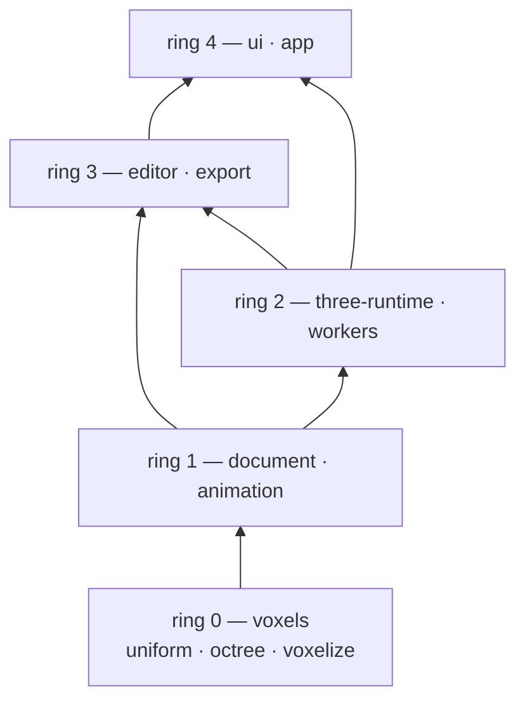

# vox-world — Architecture

## 1. What this repository is

A greenfield TypeScript + Three.js 3D voxel animation editor. The user imports a GLB mesh scene,
voxelizes it, edits spatial layout and shading, animates objects and the output camera, and exports
a playable MP4 plus per-frame aligned scene data.

Two voxel representations coexist:

- **Uniform voxels** — rule integer grid, used for objects that are animated (characters, vehicles, props).
- **Editable octree** — variable local resolution, used for very large static environments (terrain, city, scenery).

Both are *editable source data*. Render meshes, GPU buffers, LOD, and caches are always derived.

`shithill/` is a behavior and product reference only. Its architecture, runtime constraints, and
implementation patterns are not carried over.

## 2. Design principles

1. **Onion dependency** — our own modules: `import` may only point inward, toward the data. No
   module of ours depends on a module of ours that is further out.
2. **Reuse before writing** — Three.js and its ecosystem are libraries, not framework layers. Every
   part of them may be imported from every ring, including ring 0, and nothing that they already do
   is re-implemented by hand. The onion rule constrains our modules only; it never constrains the
   library.
3. **Lightweight** — no speculative abstraction, no configurability that nothing sets, no wrapper
   where a plain module or a library call works.
4. **Precedence** — conflicts here are about *our* boundaries (which module owns a piece of state,
   whether a wrapper earns its keep), not about the library. When one appears, pick the lighter
   option and record the decision in section 8.

## 3. Toolchain

Pinned exactly (no `^`). Three.js ships monthly and its addons churn; a floating range can silently
change what the demo runs on.

| Package | Version | Note |
| --- | --- | --- |
| Node | 24.21.0 (Krypton) | Active LTS, EOL 2028-04-30. Satisfies `vite@8` (`^20.19 \|\| >=22.12`) and `vitest@5` (`^22.12 \|\| ^24 \|\| >=26`). |
| three | 0.186.0 | `three` ships no types; `@types/three` is required. |
| @types/three | 0.186.0 | Exact-match type package. |
| vite | 8.3.0 | Dev server and production build. |
| vitest | 5.0.1 | Unit tests for our own modules; no GPU needed. |
| typescript | 7.0.2 | Fall back to 6.0.3 if the native compiler rejects `@types/three`. |
| mp4-muxer | 5.2.2 | MP4 container for WebCodecs-encoded video. |

Renderer: `WebGLRenderer` only. `three/webgpu` and `three/tsl` are out of scope. Addons are imported
through the `three/addons/*` export map.

## 4. Layering and dependency direction

Five rings. Ring 0 is the innermost; the number grows outward. Dependencies point inward only.



| Ring | Module | Responsibility | May import |
| --- | --- | --- | --- |
| 0 | `voxels/uniform` | Sparse uniform voxel grid, cell access and mutation, integer box region query, fill, clear, and extract. | `three` (any) |
| 0 | `voxels/octree` | Sparse octree: leaf cells with depth, size, occupancy, color, label; `split`, `merge`, `remove`, `paint`, leaf iteration, subtree extraction. | `three` (any) |
| 0 | `voxels/voxelize` | Surface voxelization of `BufferGeometry` into either representation, including color sampling and per-primitive object separation. | `voxels/*`, `three` (any) |
| 1 | `document` | Project truth: scene objects, identity, parent/child hierarchy, transforms, representation binding, timeline data, exported-camera settings, mask colors. | `voxels/*`, `three` (any) |
| 1 | `document/detach` | Cross-representation detach: octree leaf, or uniform box region, becomes a new scene object. | `voxels/*`, `three` (any) |
| 1 | `animation` | Keyframe authoring data compiled to a Three.js `AnimationClip`; frame-exact sampling through `AnimationMixer`. | `document`, `three` (any) |
| 2 | `three-runtime` | Scene and render state: GLB import into document objects, document-to-scene mirror, derived meshes, raycast picking, viewport controls, offscreen frame capture. | `voxels/*`, `document`, `three` |
| 2 | `workers` | Job boundary for off-main-thread work. Payloads must be plain records and transferables. | `voxels/*`, `document` |
| 3 | `editor` | Editing session: active object, selection, target cell selection, edit operations, output camera versus viewport navigation. | `voxels/*`, `document`, `animation`, `three-runtime` |
| 3 | `export` | Export job: frame loop over the timeline, capture orchestration, encoder and muxer. | `document`, `animation`, `three-runtime`, encoder library |
| 4 | `ui` | DOM panels, toolbars, timeline widget, export dialog, HUD. Renders state and forwards intent; owns no project state. | `document`, `animation`, `editor`, `export` |
| 4 | `app` | Composition root: the only place that knows every module. Session, jobs with progress and cancel, file input and output. | everything |

**Hard rule.** An `import` may only target its own ring or an inner ring, except for the edges
registered in section 8 (D8). This rule is about our modules. Three.js is a library and may be
imported anywhere, including ring 0, in any part: math, `Color`, geometry, animation, loaders,
`InstancedMesh`. Adding a Three.js import is never a layering violation.

`workers` is a boundary, not a layer: nothing depends on it, it depends on inner rings, and every
value crossing it must be structured-cloneable.

### Reuse Three.js rather than re-implementing it

The only thing Three.js may not do is *carry* project data, because SRS requires voxel data and
timeline data to be saveable source data while meshes, GPU buffers, and LOD are derived resources.
Concretely: a voxel container is not a `Mesh`, an object's transform is not read out of an
`Object3D`, and a `Mesh` is not a project object's identity. Everything else is fair game, and
hand-rolling is the thing that has to be justified. What that means in practice:

| Need | Taken from Three.js |
| --- | --- |
| Transform and hierarchy math | `Vector3`, `Quaternion`, `Euler`, `Matrix4` |
| Bounds, ray math, intersection tests | `Box3`, `Sphere`, `Ray`, `Plane`, `Raycaster` |
| Colors including color space | `Color`, `SRGBColorSpace` |
| Scalar helpers | `MathUtils` |
| Voxelizer input, derived meshes | `BufferGeometry`, `BufferAttribute` |
| Keyframe interpolation and playback | `KeyframeTrack`, `AnimationClip`, `AnimationMixer` — `InterpolateDiscrete` for step, `InterpolateLinear` for linear, `InterpolateSmooth` and `InterpolateBezier` for smooth |
| GLB parsing, navigation, gizmos | `GLTFLoader`, `OrbitControls`, `TransformControls` |
| Voxel and leaf rendering | `InstancedMesh`, `InstancedBufferAttribute` |

Rejected alternatives are recorded in D1 and D2.

## 5. Source layout

```
src/
  voxels/
    uniform/
      grid.ts         UniformGrid, cell key packing, integer boxes, colored cells
    octree/
      leafId.ts       LeafId codec and octant helpers
      octree.ts       sparse octree: split, merge, insert, leaf queries
    voxelize/
      surface.ts      conservative surface voxelization, triangles -> cells
      colorSampler.ts per-primitive color resolution
      voxelize.ts     request -> payloads, progress, cancel, budget guard
  document/
    project.ts        project truth: objects, hierarchy, transforms, mask colors, camera
    timeline.ts       keyframe authoring data
    detach.ts         cross-representation detach
  animation/
    compile.ts        authoring keyframes -> THREE.AnimationClip
    playback.ts       AnimationMixer wrapper, frame-exact setTime
  three-runtime/
    import.ts         GLB -> document objects + comparison meshes
    scene.ts          document -> scene mirror, derived instanced meshes, dirty rebuild
    picking.ts        raycast -> leaf, cell, or object hit
    controls.ts       OrbitControls, TransformControls, output-frame guide
    capture.ts        offscreen renderer at export resolution
    overlay.ts        box preview and leaf bounds feedback
  editor/
    session.ts        active object, tool, selection, box height
    ops.ts            edit operations over document state
    pointer.ts        pointer handling: pick, box drag, gizmo handoff
  export/
    encode.ts         codec selection, WebCodecs encoder, mp4-muxer
    job.ts            export frame loop, progress, cancel, failure reporting
  ui/
    dom.ts            element and listener helpers
    panels.ts         import, voxelize, edit, and export panels
    timeline.ts       timeline panel
    hud.ts            status: representation, edit resolution, leaf detail
  app/
    main.ts           composition root
    files.ts          file input, drag and drop, download
  workers/            deliberately empty in this slice; see section 9
tests/
  uniform.test.ts     octree.test.ts     voxelize.test.ts
  detach.test.ts      timeline.test.ts   project.test.ts
tools/
  make-demo-glb.mjs   deterministic generator for the demo GLB assets
```

Every file above has a contract in this directory (D15); `tests/` and the root config files are
covered by `codemap/tests/*.md` and `codemap/toolchain.md`.

## 6. Core data model

### Truth versus derived

| Truth (source data) | Derived (rebuilt on demand, never exported and never saved) |
| --- | --- |
| `Project.objects` and their hierarchy | Three.js `Object3D` hierarchy |
| Object transforms and names | Matrix world caches |
| Uniform cells (keys and colors) | `InstancedMesh` instances and per-instance colors |
| Octree leaves (depth, occupancy, color, label) | Leaf box geometry and leaf `BufferGeometry` |
| Timeline tracks and keyframes | `AnimationClip`, `AnimationMixer`, and the per-frame `Object3D` transforms they drive |
| Output camera settings and its track | Viewport camera and controls state |
| Object mask colors | Mask-pass material instances |

Voxel and timeline data are plain records and typed arrays, not Three.js render objects: no project
object's truth is a `Mesh`, and no project object's identity is an `Object3D`. Three.js *value*
types (`Color`, `Vector3`, `Quaternion`, `Box3`) are used freely inside that data. Derived
resources are keyed by project object id and invalidated by a per-object `dirty` flag.

### Scene objects

```
SceneObject {
  id: string            // stable, never reused, never derived from a mesh or node name
  name: string
  parentId: string | null
  transform: { position, quaternion, scale }
  representation: 'empty' | 'uniform' | 'octree'
  uniform?: UniformGrid  // present iff representation === 'uniform'
  octree?: Octree        // present iff representation === 'octree'
  maskColor: number      // object-level color, hex number as exchanged with THREE.Color
}
```

- Hierarchy is legal at all times: one parent per object, no cycles, deletion detaches children.
- `representation` binds the object to exactly one voxel container, and `Project.setPayload` is the only
  transition: importing creates `'empty'` placeholder nodes, voxelizing attaches a payload to the
  matching placeholder (turning it into a `'uniform'` or `'octree'` object without changing its id,
  name, parent, or mask color), and clearing the payload returns it to `'empty'`.
- Converting between `'uniform'` and `'octree'` is not required; only attaching and clearing payloads
  is supported.
- An object with `representation: 'empty'` is a transform-only node (group). Object hierarchy
  expresses scene structure; the octree expresses spatial resolution. The octree is never used as a
  parent/child structure, and a scene node is never used to express voxel resolution.

### Voxel cell semantics

- **Uniform grid** — object-local integer coordinates with a per-object voxel size. Occupied cells
  map to a color stored as a hex number, the form `Color.getHex()` and `Color.setHex()` exchange, so
  conversion, color-space handling, and mixing go through `THREE.Color`. Cell keys are integers
  packed from the three coordinates to keep `Map` lookups allocation-free.
- **Octree** — a root box `[0, rootSize]³` in object-local space, a maximum depth, and sparse children.
  At depth `d` the leaf edge is `rootSize / 2^d`, coordinates run over `[0, 2^d)³`, and a leaf carries
  `occupied`, `color`, and an optional `label`. Leaves at different depths are spatially disjoint by
  construction, which satisfies the non-overlap requirement for occupied cells.
- `split(leaf)` replaces one occupied leaf with eight children that inherit occupancy, color, and
  label, so the occupied volume and the visible appearance are unchanged.
- `merge(children)` is the inverse and must refuse unless all eight children are leaves with
  compatible occupancy, color, and label; it never silently discards a difference.
- `detach` moves a leaf (or a uniform box region) out of its container into a new object of the
  same representation, re-indexes the extracted content so its min corner becomes local `(0, 0, 0)`,
  and sets the transform per D23 so the world-space position, volume, and appearance are unchanged.
  The source container must not keep a duplicate occupancy at that location.
- **Uniform region selection is an axis-aligned integer box**, as in shithill's Box tool: the anchor
  is taken where the pointer goes down, the opposite corner follows the pointer, and both resolve to
  integer cell coordinates in the object's local grid. An optional fixed-height parameter overrides
  the third axis to `anchor.y + height - 1`, which is how a drag that naturally lies in a plane
  produces a slab instead of a flat sheet. A single click is the degenerate 1×1×1 box, so point
  editing needs no separate tool. Add, remove, paint, and detach all consume that one box, and the
  box volume is checked against the budget before anything is written.

**Overlap semantics.** Two different voxel objects may overlap in space: they are scene leaf nodes,
and the renderer draws both. *Within one container* voxels are never duplicated — a uniform cell is
one `Map` entry keyed by its coordinates, and octree leaves are disjoint by construction — so there
is no arbitration rule, no priority field, and no resolution pass, and none is built. Writes resolve
at allocation time instead: a write that lands in a region already covered by finer leaves descends
and paints those leaves, a write into empty space allocates at the requested depth, and painting an
occupied cell or leaf replaces its color. `merge` is the only operation that could destroy a
difference, and it refuses unless the eight children are compatible.

## 7. Cross-layer ports

Everything else is a direct call. These are the only abstractions that exist because a real boundary
requires one. The voxelizer, for instance, takes `BufferGeometry` plus a world matrix per imported
node directly, rather than a wrapper type invented for it.

| Port | Shape | Boundary it crosses |
| --- | --- | --- |
| `VoxelizeJob` | `{ request, progress, result, error }` plain records | Main thread into a worker. **Reserved, not yet declared:** no file owns this type until `src/workers/` exists (D9), which is why it is a record shape rather than an interface with methods. |
| `FrameSink` | `push(frame, index, kind)` | Renderer into the encoder. The only reason the encoder is replaceable, and the seam the mask and depth passes share. |

## 8. Decisions log

**D1 — Three.js is reused everywhere, including rings 0 and 1, in every part it can serve.**
`Vector3`, `Quaternion`, `Matrix4`, `Box3`, `Ray`, `Color`, `MathUtils`, and `BufferGeometry` are
imported wherever they fit; adding a Three.js import is never a layering violation, and hand-rolling
is what needs justification. The one thing Three.js may not do is carry project data — a voxel
container is not a `Mesh`, a transform is not read out of an `Object3D`, and a `Mesh` is not a
project object's identity — because SRS requires voxel data to be saveable source data while meshes,
buffers, and LOD are derived. Revision history: an earlier draft of this document banned Three.js
from rings 0 and 1 outright and introduced a `MeshSource` port to enforce the ban. That ban was this
document's invention, not a requirement; it was heavier, it contradicted SRS section 2 ("reuse the
Three.js ecosystem … including its math library") and ENDLIA ("reuse Three.js wheels"), and it is
withdrawn. The port went with it.

**D2 — Keyframe interpolation and playback come from Three.js.** SRS section 2 requires evaluating
`AnimationClip`/`KeyframeTrack`/`AnimationMixer` first, and they cover what is needed:
`InterpolateDiscrete` for step, `InterpolateLinear` for linear, `InterpolateSmooth` and
`InterpolateBezier` (with per-keyframe `inTangents`/`outTangents`) for smooth, and quaternion tracks
that slerp along the shortest path. Authoring keyframe arrays stay the project truth because they are
what the user edits, and they are compiled into a clip on change; the mixer evaluates playback, and
the export loop drives it with a frame-exact `setTime`. Revision history: an earlier draft proposed a
hand-written sampler. Withdrawn — it was more code than the compile step it would replace.

**D3 — GLB import converts to document objects; the Three.js scene is a derived mirror.** Cost: the
hierarchy exists twice, once as truth and once as a view. Gain: stable identity, editing, and later
persistence, all of which SRS requires.

**D4 — Derived meshes rebuild lazily behind a per-object `dirty` flag.** No resource manager, no
incremental update graph, no scheduler.

**D5 — Picking raycasts against derived meshes, then maps `instanceId` back to a cell or leaf.** No
CPU voxel traversal. When several candidates overlap, the order is fixed: deeper leaf first, then
nearer hit distance, then ascending leaf id. SRS requires a deterministic pick order.

**D6 — Detach is a `document` operation, not a `voxels` operation.** `voxels` exposes leaf and box
region primitives; `document` owns identity, transforms, and hierarchy. This is what
makes a second detach (a character into hands and feet) work without a special case.

**D7 — `export` splits capture from encoding behind `FrameSink`.** Codec selection is tried in the
order `avc1`, `av01`, `vp09`, and the chosen codec is reported to the user. Browsers without a
software H.264 encoder produce AV1-in-MP4; that is accepted and stated at export time rather than
silently substituting.

**D8 — Registered same-ring edges.** Exactly three are allowed:
`voxels/voxelize -> voxels/{uniform,octree}`, `voxels/octree -> voxels/uniform` (shared value types
`HexColor` and `IntBox3` only), and `animation -> document`. Any new one must be added to this list
with a reason.

**D9 — The demo slice omits undo, project persistence, and the worker.** Edit operations are written
as pure functions over document state with an explicit apply step, so a command and undo layer can
wrap them without rewriting them, and voxelization takes nothing but geometry, a world matrix, and
options, so it can move into a worker unchanged. See section 9.

**D10 — Object hierarchy is the runtime truth; the octree holds no object structure.** SRS requires
this split, and it also keeps octree operations independent of scene editing.

**D11 — Mask color is an explicit per-object field**, assigned from a palette on creation and
editable by the user, rather than derived from object order at export time. It is a channel separate
from cell color: cell color is the *appearance* channel and `maskColor` is the *identity* channel used
by the mask export pass, so mask export is one flat material per object and never a per-cell recolor.

**D12 — A voxel budget is checked before a voxelization commit**, not after. Exceeding it fails the
task with the measured cell count and the limit; the existing scene is left untouched.

**D13 — The UI uses plain DOM, not a framework.** The panels are few and state is read from the
editor session, so a reactive framework would add a build step and a dependency without removing work.

**D14 — Colors are hex numbers, converted through `THREE.Color`.** `Color.setHex`/`getHex` is the
exchange format, so color space, mixing, and conversion come from Three.js instead of hand-written
math, while a cell still stores one plain number — cheap at millions of cells and directly usable as
an `InstancedMesh` instance color. No palette indirection.

**D15 — Contract paths mirror `src/` one-to-one without an extra `src` segment** — that is,
`src/voxels/octree/octree.ts` is described by `codemap/voxels/octree/octree.md`. `AGENTS.md` writes the
contract root as `codemap/src/**/*.md`; the `src` segment is redundant here and the existing
`codemap/` scaffold does not have it. `tests/` and the root config files are covered by
`codemap/tests/*.md` and `codemap/toolchain.md`. This deviation is recorded deliberately so it is not
read as drift.

**D16 — `npm run check` means typecheck plus unit tests.** No linter or formatter is configured for
the demo slice; adding one later does not change this document.

**D17 — Scene convention: Y-up, right-handed, meters, one unit per world meter.** The output camera
is a document node with position, orientation, and vertical FOV. The viewport navigation camera is
Three.js runtime state and is never project data. Both voxel representations share this convention,
which is what allows one timeline and one export path to cover both. Concretely there are exactly two
cameras at runtime: `SceneMirror.camera` is the **output** camera, derived from `project.camera` and
used for export, for the aspect guide, and for FOV tracks; the **viewport** camera is created by the
app, is the one `ViewportControls` moves by default, and is never rendered into the output. The single
exception is the camera lock: while the user locks navigation to the output camera, `ViewportControls`
retargets to `mirror.camera`, the viewport renders through it, and each navigation change is copied
into `project.camera.transform` so a camera keyframe records the authored pose. The copy is refused
while the mixer is playing, because authored data must never be written from a running clip.

**D18 — Overlap between objects is allowed; inside one container there is nothing to arbitrate.** A
voxel object is a scene leaf node, so a car may overlap terrain voxels and no cross-object resolution
is attempted. Within one container, occupied cells are unique by construction — one `Map` entry per
uniform coordinate, disjoint octree leaves — so no priority field, no resolution pass, and no
last-writer bookkeeping exists, and none is built for the demo. Writes resolve at allocation time
instead, and repainting an occupied cell simply replaces its color (section 6).

**D19 — Uniform selection is exactly one dragged box, and nothing else.** The box is an axis-aligned
integer box in the object's local grid: anchor at pointer-down, opposite corner following the
pointer, and an optional fixed height overriding the third axis (shithill's Box tool:
`box_add`/`box_remove` take `startBox` on pointer-down, read `fixedHeight` from the height field, and
`boxShape` derives the integer min/max corners; a drag that exceeds `MAX_VOXELS_DRAW` is abandoned
rather than clamped). Add, remove, paint, and detach all consume this one region, and a click is the
degenerate 1×1×1 box. Deliberately excluded: screen-space marquee selection with a surface-only
versus all-depth policy (shithill's `rect_*`), and flood-fill or connected-component picking. Both
were considered and dropped — a box is exact, cheap to implement, needs no similarity heuristic, and
already covers splitting a car or a hand off a body. Octree selection is unaffected: there the unit
stays a single picked leaf.

**D20 — Cell indexing is min-corner, in object-local space, in both representations.** A voxel of size
`v` at integer cell `(x, y, z)` occupies `[x*v, (x+1)*v]` on each axis. Uniform coordinates may be
negative and key packing covers `[-512, 511]`; an octree's root box is `[0, rootSize]³` with
coordinates `[0, 2^depth)³` at depth `depth`, so octree coordinates are never negative. Detach
re-indexes the extracted content so its min corner becomes local `(0, 0, 0)` and gives the new object
a translation-only transform equal to the extracted region's world min corner. A detached octree leaf
becomes an octree whose root box *is* that leaf box, carrying the same `maxDepth` as its source, so it
can be split and detached again. Min-corner indexing is what keeps this rebase exact for odd-sized
regions; a center-origin convention would introduce half-cell offsets.

**D21 — Voxelization bakes node transforms.** Triangle soups are transformed into world space before
voxelization, so a voxelized object carries a translation-only transform and its payload is
axis-aligned in world space. Consequences accepted for this slice: imported node rotation and scale
are baked in, voxelized output is one flat object per source node rather than a mirrored hierarchy,
and re-voxelizing after moving an object means deleting and voxelizing again. SRS only requires that
layout and object correspondence survive, and this removes a whole layer of transform bookkeeping from
the voxel path.

**D22 — The mirror's scene root is the single `AnimationMixer` root, and object naming is the binding
contract.** Every mirrored `Object3D` is named with its `ObjectId`, and the output camera is a child of
the scene root named `camera`. Because track names in a clip are property paths relative to the mixer
root, that naming is what lets one mixer drive both object transforms and camera FOV with paths like
`<ObjectId>.position` and `camera.fov`, with no per-object mixer and no rebinding on reparenting.
Renaming an object never touches `Object3D.name`; the display name lives only in the document.

**D23 — Detach placement is `parentWorld⁻¹ ∘ regionWorld`, which reduces to a translation while every
ancestor has identity rotation and scale.** D21 keeps voxelized objects flat with translation-only
transforms, so the reduction holds for everything the demo produces. The general form is written down
so that a rotated or scaled ancestor cannot silently misplace a detached child later.

**D24 — Camera layers separate what is edited, what is only shown, and what is exported.** Layer 0 is
scene content: the voxel instances and the output camera, and it is the only layer an export renders.
Layer 1 is viewport feedback — the box preview, leaf bounds, and the export aspect guide — which is
never picked and never exported. Layer 2 is the imported source mesh, kept for the raw-mesh versus
voxel comparison: the viewport camera enables 0, 1, and 2; the raycaster tests 0 and 2; the export
camera and `Capture` use 0 alone, which is what keeps an un-voxelized source mesh out of an exported
frame (SRS forbids exporting the mesh and its voxels together). `frameAll` measures 0 and 2 so an
import frames the real model before any voxel exists. Feedback uses layers rather than an `if` at each
call site.

**D25 — A payload is world space, so attaching one makes the node translation-only, and a source mesh
carries its own baked node matrix.** `voxelize` bakes node transforms into world space (D21) and its
cells are axis-aligned there, so the object holding the payload may keep only a translation: attaching
a payload sets `position = origin`, identity quaternion, unit scale. Leaving the node's imported
rotation or non-uniform scale in place would transform the payload a second time — which is exactly
what a Sketchfab export exposes, where the root chain mixes a -90° X rotation with 0.58/0.58/0.33-type
non-uniform scales, and the whole scene lands rotated, sheared, and mis-scaled. The mirror then keeps
the raw-mesh comparison glued to its import position by giving each source object its baked node
matrix (`matrix = project.worldMatrix(id)⁻¹ ∘ nodeWorldMatrix`, `matrixAutoUpdate = false`), which
reduces to the identity before voxelization and to a `-origin` offset after it.

**D26 — Importing a GLB voxelizes immediately.** There is no separate voxelize step: the import path
runs voxelization with the current settings and attaches one payload per imported node, and the
resolution controls re-voxelize the retained import instead of gating a button. The import is the
moment the user's content becomes editable, so a second confirmation click is friction with no
decision behind it (the settings are the decision, and they are visible).

**D27 — Stylized content needs an alpha cutoff and an outline-mesh rule, both name/flag driven.**
Ported from the previous project's fix (`shithill` commit `54b73b6c0c480014736909b52868fb42cc246e87`,
"preserve masked foliage colors and omit outline meshes"):

- **Outline meshes** are the inverted-hull shells stylized exports add. A mesh is one when *every*
  assigned material is named exactly `line` (trimmed, case-insensitive) — never inferred from a black
  colour, because ordinary black geometry is model content. Outline meshes are excluded from
  voxelization and from the bounds that derive the octree root and the default voxel size, so a shell
  slightly larger than the model cannot inflate either. They stay in the raw-mesh display, because they
  are part of how the source model looks, so their document objects simply remain `'empty'`.
- **Alpha cutoffs**: a texel below `material.alphaTest` keeps its voxel — dropping the cell is what
  fragments foliage and grass at low resolution — and takes the cached average colour of that
  texture's visible texels instead, keyed by cutoff. A fully transparent texel with no cutoff
  contributes no texture term. Coverage stays the voxelizer's business; the sampler only chooses a
  colour.

**D28 — An import is one object with one payload.** Chosen by the user after seeing the overlap
evidence: per-mesh objects put every payload on the same world lattice, so two objects covering the
same cell draw coincident cubes in different colours and the scene looks doubled. Sources therefore
carry **parts** (one per material-bearing mesh, in traversal order) that all write into one payload,
where the first part to claim a cell keeps it and later parts skip claimed cells — one cell, one
colour, deterministic. Consequences, accepted with the decision: the imported scene is no longer
separately selectable per node, so a car inside an island import is separated with the box tool plus
Detach (scenario A), and a part's colour wins wherever it is *inside* another part's volume — the
merged grid has no interior geometry at all, which is the point. Two axes of the earlier model stay
untouched: per-object payloads are still the unit of animation and of Detach, and objects created
after the import still overlap each other freely (D18), because nothing merges across objects.

## 9. Demo slice

The first runnable version must demonstrate the two acceptance scenarios end to end. Everything
listed as deferred is deferred deliberately, not forgotten.

### In scope

- Import a GLB, auto-frame the view, and show the raw mesh for comparison against the voxel result.
- Voxelization runs on import as one object with one payload, as uniform or octree, with progress,
  cancel, and a budget guard; changing the resolution re-runs it.
- Toggle the raw mesh against the voxel result; assign one mask color per object.
- Select and edit voxel objects: create, name, delete, hide, transform, reparent.
- Octree: pick a leaf and show its bounds, depth, size, occupancy, and color; split, merge, remove,
  paint; detach a leaf as a new object.
- Uniform: drag a box (anchor, opposite corner, optional fixed height) and add, remove, paint, or
  detach it as a new object; a click is a 1×1×1 box.
- Timeline: duration and frame rate, keyframes on object transforms and on the output camera,
  step/linear/smooth interpolation, play, pause, stop, loop, scrub.
- Export the output camera view to a real MP4 with selectable resolution, frame rate, and range,
  with progress, cancel, and failure reporting.

### Acceptance flows

- **Scenario A** — import `island.glb`, which arrives as one object with one payload; separate the car
  from it with the box tool plus Detach, give the car and the output camera keyframes, export an MP4
  with the mask colors.
- **Scenario B** — import `big.glb`, voxelize as octree, pick leaves and split/remove/paint them,
  detach a leaf into a character object, split it further, detach hands and feet, animate all three
  objects on the same timeline, export through the same path.

Both flows use one timeline and one export path; that is the acceptance criterion for the mixed
scene requirement.

### Deferred

| Deferred | Why it is safe to defer |
| --- | --- |
| Undo and redo, command transactions | Edit operations are pure; the wrapper does not change them (D9). |
| Project save and load, schema versioning | `document` stays plain records; serialization is additive. |
| Voxelization worker | Voxelization touches no scene state and is driven by a chunked loop with progress and cancel (D9). |
| Depth and object-id frame export | The mask pass already proves the second pass path; the MP4 is the required deliverable. |
| Base color texture sampling | Demo assets use material base color and vertex colors; sampling will go through `THREE.Color` and the geometry attributes. |
| Skinning, morph targets, animations inside GLB | SRS explicitly does not require them. |
| View-dependent LOD, octree pruning, GPU memory offload | Not needed at demo scale. |

## 10. Validation

```bash
npm run typecheck   # tsc --noEmit
npm test            # vitest run
npm run check       # typecheck + test (D16)
npm run dev         # vite dev server
npm run build       # production build
git diff --check
```

Unit tests cover our own modules — voxels, document, animation: octree split/merge invariants (volume
and appearance preserved, no overlapping occupied leaves), detach identity and world-space
preservation, uniform box region math and extraction, project hierarchy legality and payload
transitions, clip compilation and frame-exact sampling, and voxelization surface correctness.
Rendering, picking, and export are verified by running the application and by inspecting the produced
MP4.

## 11. Contracts

Per-file contracts live in this directory, mirroring `src/` (D15):

```
codemap/voxels/uniform/grid.md      -> src/voxels/uniform/grid.ts
codemap/voxels/octree/octree.md     -> src/voxels/octree/octree.ts
codemap/document/project.md         -> src/document/project.ts
codemap/animation/playback.md       -> src/animation/playback.ts
codemap/tests/octree.md             -> tests/octree.test.ts
codemap/toolchain.md                -> package.json, tsconfig.json, vite.config.ts,
                                       vitest.config.ts, index.html
```

Each contract states the file's responsibility, its public interface as TypeScript signatures, its
internal logic, its invariants, its error results, its dependencies, and the tests that pin it. No
implementation file is added without its contract in the same change, per `AGENTS.md` section 3.
Contracts are read critically: a contract rule that is unsound or contradicts this document is
reported, not silently followed.

### Conventions every contract follows

- ESM, no barrel `index.ts`; imports carry the `.js` extension.
- No `any`; `unknown` only at parse and IO boundaries, narrowed immediately.
- User-facing operations (import, voxelize, export, detach, file IO) return a discriminated result
  `{ ok: true; ... } | { ok: false; error: '<literal-union>'; detail: string }`. Programmer errors
  (bad argument type, out-of-range index, violated invariant) throw `TypeError` or `RangeError`.
- Long operations run as chunked loops that yield to the host every `CHUNK = 512` items and accept an
  `AbortSignal`, so progress and cancel work on the main thread without a worker.
- Units are meters; cell indexing, color channels, identity rules, box semantics, and traversal order
  are as specified in sections 4, 6, and D11/D18/D19/D20.
- Tests live in `tests/<name>.test.ts` and run under vitest in the node environment: no GPU, no DOM,
  no `WebGLRenderer`. Importing `three` for math and geometry is allowed.

## 12. Open questions

These come from SRS section 5. Each must be resolved before the feature that depends on it ships, and
the resolution recorded here. The first runnable slice answers them provisionally so it can be built;
a provisional answer is a working default, not a settled design.

| Question | Provisional answer for this slice | Still open |
| --- | --- | --- |
| Octree root extent and extension policy | The root box is fixed per object as `[0, rootSize]³` (D20). Sizing comes from the source bounds at voxelization time; there is no dynamic root extension yet. | Root growth for a scene that outgrows its box. The reference paper doubles the root and re-parents the eight depth-1 nodes into the new root's central octant at `O(1)` cost; that is the shape to adopt when it is needed. |
| Maximum depth and minimum leaf size | `maxDepth = 10` per octree object, so the minimum leaf is `rootSize / 1024`. | Whether the limit should be global, per object, or driven by a target leaf size. |
| How leaf depth is chosen on first voxelization | From a target cell size: `depth = clamp(ceil(log2(rootSize / targetCellSize)), 1, maxDepth)`. The user sets the target size; nothing is derived from camera distance (SRS forbids that). | Whether the demo needs a per-region target (for example finer near the camera path). |
| Stable leaf identity | `LeafId` is `"<depth>:<octant digits>"` (D20), stable across splits because a child extends its parent's id. | Whether leaf identity must survive a merge/split round trip as the same id; today a re-split produces the original ids again, which is the same thing in practice. |
| Label data form | A single optional `label: string` per leaf, inherited by split and used as the detached object's name. | Whether labels need to be multi-valued, structured, or indexed for selection. |
| Representation of a detached object whose source is an octree | Octree, with the root box equal to the detached leaf box and the source's `maxDepth`, so it can be split and detached again (D20). | Whether a detached object should ever be flattened to uniform voxels for cheaper animation. |
| GLB feature range | Uncompressed glTF 2.0 geometry, `pbrMetallicRoughness.baseColorFactor`, and vertex colors. Draco, Meshopt, and KTX2 are reported as `unsupported` rather than half-loaded. | Which extensions real content actually needs. |
| Color sampling for textures | Base color factor and vertex colors only; texture sampling is deferred and the sampling seam is `ColorSource`. | UV sampling rules, wrapping, and color space handling for textured content. |
| Real-world scale and budget | Voxelization aborts above `budget = 4_000_000` cells and the existing scene is left untouched. | The budget for real content, and whether it must be split into a per-object quota plus a total. |
