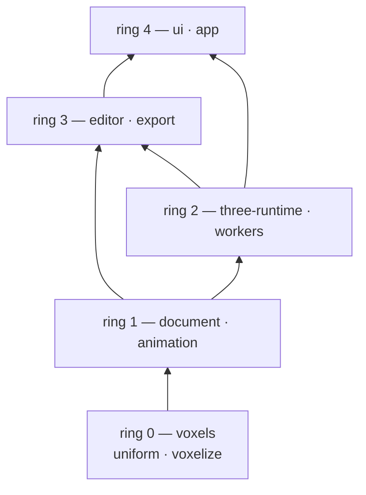

# vox-world — Architecture

## 1. What this repository is

A greenfield TypeScript + Three.js 3D voxel animation editor. The user imports a GLB mesh scene,
voxelizes it, edits spatial layout and shading, animates objects and the output camera, and exports
a playable MP4 plus per-frame aligned scene data.

Voxels are a **sparse uniform grid**: object-local integer cell coordinates with a per-object voxel size,
held as *editable source data*. Render meshes, GPU buffers, LOD, and caches are always derived.

The editable octree the SRS asked for as a second representation was removed at the user's request (D34),
so there is no variable local resolution and no leaf-level editing: a very large static environment is
voxelized at one resolution like everything else, and shares the same cell budget.

`shithill/` is a behavior and product reference only. Its architecture, runtime constraints, and
implementation patterns are not carried over.

## 2. Design principles

1. **Onion dependency** — our own modules: `import` may only point inward, toward the data. No
   module of ours depends on a module of ours that is further out.
2. **Reuse before writing** — Three.js and its ecosystem are libraries, not framework layers. Every
   part of them may be imported from every ring, including ring 0, and nothing that they already do
   is re-implemented by hand. The onion rule constrains our modules only; it never constrains the
   library.
3. **Lightweight** — no speculative abstraction, no configurability that nothing sets, no wrapper
   where a plain module or a library call works.
4. **Precedence** — conflicts here are about *our* boundaries (which module owns a piece of state,
   whether a wrapper earns its keep), not about the library. When one appears, pick the lighter
   option and record the decision in section 8.

## 3. Toolchain

Pinned exactly (no `^`), with one exception: `@pmndrs/vanilla` carries a caret, because its grid is a component rather
than the renderer and D49's patches are what pin it in practice. Three.js ships monthly and its addons churn; a floating
range can silently change what the demo runs on.

| Package | Version | Note |
| --- | --- | --- |
| Node | 24.21.0 (Krypton) | Active LTS, EOL 2028-04-30. Satisfies `vite@8` (`^20.19 \|\| >=22.12`) and `vitest@5` (`^22.12 \|\| ^24 \|\| >=26`). |
| three | 0.186.0 | `three` ships no types; `@types/three` is required. |
| @types/three | 0.186.0 | Exact-match type package. |
| @pmndrs/vanilla | ^1.25.0 | pmndrs' framework-free port of the drei components, MIT; the grid imports its `Grid` (`@pmndrs/vanilla/core/Grid`) and nothing else (D49). The one caret range: the two patches that file applies to its shaders are written against its source, and the tests are what catch a change (D49). |
| vite | 8.3.0 | Dev server and production build. |
| vitest | 5.0.1 | Unit tests for our own modules; no GPU needed. |
| typescript | 7.0.2 | Fall back to 6.0.3 if the native compiler rejects `@types/three`. |
| mp4-muxer | 5.2.2 | MP4 container for WebCodecs-encoded video. |

Renderer: `WebGLRenderer` only. `three/webgpu` and `three/tsl` are out of scope. Addons are imported
through the `three/addons/*` export map.

## 4. Layering and dependency direction

Five rings. Ring 0 is the innermost; the number grows outward. Dependencies point inward only.



| Ring | Module | Responsibility | May import |
| --- | --- | --- | --- |
| 0 | `voxels/uniform` | Sparse uniform voxel grid, cell access and mutation, integer box region query, fill, clear, and extract. | `three` (any) |
| 0 | `voxels/voxelize` | Surface voxelization of `BufferGeometry` into a uniform payload, including color sampling and per-primitive object separation. | `voxels/*`, `three` (any) |
| 1 | `document` | Project truth: scene objects, identity, parent/child hierarchy, transforms, representation binding, timeline data, exported-camera settings, mask colors. | `voxels/*`, `three` (any) |
| 1 | `document/detach` | Detach: a uniform box region becomes a new scene object. | `voxels/*`, `three` (any) |
| 1 | `animation` | Keyframe authoring data compiled to a Three.js `AnimationClip`; frame-exact sampling through `AnimationMixer`. | `document`, `three` (any) |
| 2 | `three-runtime` | Scene and render state: GLB import into document objects, document-to-scene mirror, derived meshes, raycast picking, viewport controls, offscreen frame capture. | `voxels/*`, `document`, `three`, `@pmndrs/vanilla` (the grid's `Grid`, D49) |
| 2 | `workers` | Job boundary for off-main-thread work. Payloads must be plain records and transferables. | `voxels/*`, `document` |
| 3 | `editor` | Editing session: active object, selection, target cell selection, edit operations, output camera versus viewport navigation. | `voxels/*`, `document`, `animation`, `three-runtime` |
| 3 | `export` | Export job: frame loop over the timeline, capture orchestration, encoder and muxer. | `document`, `animation`, `three-runtime`, encoder library |
| 4 | `ui` | DOM panels, toolbars, timeline widget, export dialog, HUD. Renders state and forwards intent; owns no project state. | `document`, `animation`, `editor`, `export` |
| 4 | `app` | Composition root: the only place that knows every module. Session, jobs with cancel, file input and output, and the console report a failure gets. | everything |

**Hard rule.** An `import` may only target its own ring or an inner ring, except for the edges
registered in section 8 (D8). This rule is about our modules. Three.js is a library and may be
imported anywhere, including ring 0, in any part: math, `Color`, geometry, animation, loaders,
`InstancedMesh`. Adding a Three.js import is never a layering violation.

`workers` is a boundary, not a layer: nothing depends on it, it depends on inner rings, and every
value crossing it must be structured-cloneable.

### Reuse Three.js rather than re-implementing it

The only thing Three.js may not do is *carry* project data, because SRS requires voxel data and
timeline data to be saveable source data while meshes, GPU buffers, and LOD are derived resources.
Concretely: a voxel container is not a `Mesh`, an object's transform is not read out of an
`Object3D`, and a `Mesh` is not a project object's identity. Everything else is fair game, and
hand-rolling is the thing that has to be justified. What that means in practice:

| Need | Taken from Three.js |
| --- | --- |
| Transform and hierarchy math | `Vector3`, `Quaternion`, `Euler`, `Matrix4` |
| Bounds, ray math, intersection tests | `Box3`, `Sphere`, `Ray`, `Plane`, `Raycaster` |
| Colors including color space | `Color`, `SRGBColorSpace` |
| Scalar helpers | `MathUtils` |
| Voxelizer input, derived meshes | `BufferGeometry`, `BufferAttribute` |
| Keyframe interpolation and playback | `KeyframeTrack`, `AnimationClip`, `AnimationMixer` — `InterpolateDiscrete` for step, `InterpolateLinear` for linear, `InterpolateSmooth` and `InterpolateBezier` for smooth |
| GLB parsing, navigation, gizmos | `GLTFLoader`, `OrbitControls`, `TransformControls` |
| Voxel rendering | `InstancedMesh`, `InstancedBufferAttribute` |

Rejected alternatives are recorded in D1 and D2.

The viewport's grid is the one drawing taken from outside these lists — it still builds on `three`'s `Mesh`,
`PlaneGeometry`, and `ShaderMaterial` — because `three` has no grid material and a shader grid is not worth
hand-rolling, so the drawing comes from `@pmndrs/vanilla`'s `Grid` (D49), the import registered in the ring table
above; the file that uses it patches two things in the library's shaders that this viewport needs and the library does
not do.

## 5. Source layout

```
src/
  voxels/
    uniform/
      grid.ts         UniformGrid, cell key packing, integer boxes, colored cells
    voxelize/
      surface.ts      conservative surface voxelization, triangles -> cells
      colorSampler.ts per-primitive color resolution
      voxelize.ts     request -> payloads, progress, cancel, budget guard
  document/
    project.ts        project truth: objects, hierarchy, transforms, mask colors, camera
    timeline.ts       keyframe authoring data
    detach.ts         cross-representation detach
  animation/
    compile.ts        authoring keyframes -> THREE.AnimationClip
    playback.ts       AnimationMixer wrapper, frame-exact setTime
  three-runtime/
    import.ts         GLB -> document objects + comparison meshes
    scene.ts          document -> scene mirror, derived instanced meshes, dirty rebuild
    picking.ts        raycast -> cell or object hit
    controls.ts       OrbitControls, TransformControls, gizmo claim
    capture.ts        offscreen renderer at export resolution
    overlay.ts        box preview feedback
    cameraControl.ts  runtime-only carrier drawing the output camera: three's frustum and up marker
  editor/
    session.ts        active object, tool, selection
    ops.ts            edit operations over document state
    pointer.ts        pointer handling: pick, box drag, gizmo handoff
  export/
    encode.ts         codec selection, WebCodecs encoder, mp4-muxer
    job.ts            export frame loop, cancel, failure reporting
  ui/
    dom.ts            element and listener helpers
    floatingWindow.ts movable, closable window holding one group's controls
    panels.ts         the group rail and each group's window content
    voxelizeDialog.ts voxelization settings modal
    timeline.ts       timeline panel
    hud.ts            status: representation and edit resolution
    modeBar.ts        viewport mode switch: Object (gizmo) / Edit (voxel tools)
  app/
    main.ts           composition root
    files.ts          file input, drag and drop, download
  workers/            deliberately empty in this slice; see section 9
tests/
  uniform.test.ts     voxelize.test.ts   detach.test.ts
  timeline.test.ts    project.test.ts
```

Every file above has a contract in this directory (D15); `tests/` and the root config files are
covered by `codemap/tests/*.md` and `codemap/toolchain.md`.

## 6. Core data model

### Truth versus derived

| Truth (source data) | Derived (rebuilt on demand, never exported and never saved) |
| --- | --- |
| `Project.objects` and their hierarchy | Three.js `Object3D` hierarchy |
| Object transforms and names | Matrix world caches |
| Uniform cells (keys and colors) | `InstancedMesh` instances and per-instance colors |
| Timeline tracks and keyframes | `AnimationClip`, `AnimationMixer`, and the per-frame `Object3D` transforms they drive |
| Output camera settings and its track | Viewport camera and controls state |
| Object mask colors | Mask-pass material instances |

Voxel and timeline data are plain records and typed arrays, not Three.js render objects: no project
object's truth is a `Mesh`, and no project object's identity is an `Object3D`. Three.js *value*
types (`Color`, `Vector3`, `Quaternion`, `Box3`) are used freely inside that data. Derived
resources are keyed by project object id and invalidated by a per-object `dirty` flag.

### Scene objects

```
SceneObject {
  id: string            // stable, never reused, never derived from a mesh or node name
  name: string
  parentId: string | null
  transform: { position, quaternion, scale }
  representation: 'empty' | 'uniform'
  uniform?: UniformGrid  // present iff representation === 'uniform'
  maskColor: number      // object-level color, hex number as exchanged with THREE.Color
}
```

- Hierarchy is legal at all times: one parent per object, no cycles, deletion detaches children.
- `representation` binds the object to exactly one voxel container, and `Project.setPayload` is the only
  transition: importing creates `'empty'` placeholder nodes, voxelizing attaches a payload to the
  matching placeholder (turning it into a `'uniform'` object without changing its id, name, parent, or
  mask color), and clearing the payload returns it to `'empty'`.
- Placement sits on the world grid by default (D42): every object is created with `alignToGrid` set, and
  while it is set the object's own transform holds a whole number of *its own* cells (D43) — one world unit at
  subdivision 1 — so its voxels fall on the lattice rather than half a cell off it. A transform write snaps to the nearest cell — the gizmo's live preview is
  snapped the same way, so a release never jumps — and a keyframe authored for the object's position stores
  whole cells, while the mixer keeps interpolating smoothly between them. The flag is the panel's `Grid align`
  checkbox, and switching it on pulls the object onto the grid there and then.
- An object with `representation: 'empty'` is a transform-only node (group). Object hierarchy is the
  only structure there is: a scene node is never used to express voxel resolution, and no voxel
  container ever holds object structure (D10).

### Voxel cell semantics

- **Uniform grid** — object-local integer coordinates whose *world* size comes from the world unit and the object's
  subdivision: a cell is `1 / subdivision` of a world unit (D41, D43), so a cell coordinate is a world coordinate
  divided by that subdivision and a grid stores its subdivision rather than a length. An import is scaled onto that lattice as it arrives, so
  a model's length in the world is its voxel count. Occupied cells
  map to a color stored as a hex number, the form `Color.getHex()` and `Color.setHex()` exchange, so
  conversion, color-space handling, and mixing go through `THREE.Color`. Cell keys are integers
  packed from the three coordinates to keep `Map` lookups allocation-free.
- `detach` moves a uniform box region out of its container into a new object of the same
  representation, re-indexes the extracted content so its min corner becomes local `(0, 0, 0)`,
  and sets the transform per D23 so the world-space position, volume, and appearance are unchanged.
  The source container must not keep a duplicate occupancy at that location.
- **Uniform region selection is an axis-aligned integer box**, as in shithill's Box tool: the anchor
  is taken where the pointer goes down, the opposite corner follows the pointer, and both resolve to
  integer cell coordinates in the object's local grid, inclusive on both corners and one cell deep on the
  axis the drag runs along, so what the pointer draws is what commits (D19, D36). A single click is the
  degenerate 1×1×1 box, so point editing needs no separate tool. In edit mode `select` consumes that box as the selection
  and writes nothing; `add`, `paint`, and `remove` apply an operation to it, and the box volume is checked against the
  budget before anything is written. Detaching that region is a command on it rather than a fourth mode — the Edit
  group's `detach` button, disabled while nothing is selected — so no tool can be left armed to detach the next
  thing a press lands on.

**Overlap semantics.** Two different voxel objects may overlap in space: they are scene leaf nodes,
and the renderer draws both. *Within one container* voxels are never duplicated — a uniform cell is
one `Map` entry keyed by its coordinates — so there is no arbitration rule, no priority field, and no
resolution pass, and none is built. Writing a cell that is already occupied replaces its color, which
is the only collision a single container can have.

## 7. Cross-layer ports

Everything else is a direct call. These are the only abstractions that exist because a real boundary
requires one. The voxelizer, for instance, takes `BufferGeometry` plus a world matrix per imported
node directly, rather than a wrapper type invented for it.

| Port | Shape | Boundary it crosses |
| --- | --- | --- |
| `VoxelizeJob` | `{ request, progress, result, error }` plain records | Main thread into a worker. **Reserved, not yet declared:** no file owns this type until `src/workers/` exists (D9), which is why it is a record shape rather than an interface with methods. |
| `FrameSink` | `push(frame, index, kind)` | Renderer into the encoder. The only reason the encoder is replaceable, and the seam the mask and depth passes share. |

## 8. Decisions log

**D1 — Three.js is reused everywhere, including rings 0 and 1, in every part it can serve.**
`Vector3`, `Quaternion`, `Matrix4`, `Box3`, `Ray`, `Color`, `MathUtils`, and `BufferGeometry` are
imported wherever they fit; adding a Three.js import is never a layering violation, and hand-rolling
is what needs justification. The one thing Three.js may not do is carry project data — a voxel
container is not a `Mesh`, a transform is not read out of an `Object3D`, and a `Mesh` is not a
project object's identity — because SRS requires voxel data to be saveable source data while meshes,
buffers, and LOD are derived. Revision history: an earlier draft of this document banned Three.js
from rings 0 and 1 outright and introduced a `MeshSource` port to enforce the ban. That ban was this
document's invention, not a requirement; it was heavier, it contradicted SRS section 2 ("reuse the
Three.js ecosystem … including its math library") and ENDLIA ("reuse Three.js wheels"), and it is
withdrawn. The port went with it.

**D2 — Keyframe interpolation and playback come from Three.js.** SRS section 2 requires evaluating
`AnimationClip`/`KeyframeTrack`/`AnimationMixer` first, and they cover what is needed:
`InterpolateDiscrete` for step, `InterpolateLinear` for linear, `InterpolateSmooth` and
`InterpolateBezier` (with per-keyframe `inTangents`/`outTangents`) for smooth, and quaternion tracks
that slerp along the shortest path. Authoring keyframe arrays stay the project truth because they are
what the user edits, and they are compiled into a clip on change; the mixer evaluates playback, and
the export loop drives it with a frame-exact `setTime`. Revision history: an earlier draft proposed a
hand-written sampler. Withdrawn — it was more code than the compile step it would replace.

**D3 — GLB import converts to document objects; the Three.js scene is a derived mirror.** Cost: the
hierarchy exists twice, once as truth and once as a view. Gain: stable identity, editing, and later
persistence, all of which SRS requires.

**D4 — Derived meshes rebuild lazily behind a per-object `dirty` flag.** No resource manager, no
incremental update graph, no scheduler.

**D5 — Picking raycasts against derived meshes, then maps `instanceId` back to a cell.** No CPU voxel
traversal. When several candidates overlap, the order is fixed: nearer hit distance first, then ascending
object id, then ascending cell coordinates. SRS requires a deterministic pick order. The deeper-leaf and
ascending-leaf-id ranks this order used to carry left with the octree (D33).

**D6 — Detach is a `document` operation, not a `voxels` operation.** `voxels` exposes the box region
primitive; `document` owns identity, transforms, and hierarchy. This is what makes a second detach (a
character into hands and feet) work without a special case. Half of the original decision — the octree
leaf it also covered — left with the octree (D33).

**D7 — `export` splits capture from encoding behind `FrameSink`.** Codec selection is tried in the
order `avc1`, `av01`, `vp09`, and the chosen codec is reported to the user. Browsers without a
software H.264 encoder produce AV1-in-MP4; that is accepted and stated at export time rather than
silently substituting.

**D8 — Registered same-ring edges.** Exactly two are allowed: `voxels/voxelize -> voxels/uniform`
(shared value types `HexColor` and `IntBox3` only) and `animation -> document`. Any new one must be
added to this list with a reason.

**D9 — The demo slice omits undo, project persistence, and the worker.** Edit operations are written
as pure functions over document state with an explicit apply step, so a command and undo layer can
wrap them without rewriting them, and voxelization takes nothing but geometry, a world matrix, and
options, so it can move into a worker unchanged. See section 9.

**D10 — Object hierarchy is the runtime truth, and no voxel container holds object structure.** SRS
requires this split. Its second half — that octree operations stay independent of scene editing — is
moot now that there is no octree (D33); the rule that survives is that a parent/child relation is
expressed by `SceneObject.parentId` and never by a container.

**D11 — Mask color is an explicit per-object field**, assigned from a palette on creation and
editable by the user, rather than derived from object order at export time. It is a channel separate
from cell color: cell color is the *appearance* channel and `maskColor` is the *identity* channel used
by the mask export pass, so mask export is one flat material per object and never a per-cell recolor.

**D12 — A voxel budget is checked before a voxelization commit**, not after. Exceeding it fails the
task with the measured cell count and the limit; the existing scene is left untouched.

**D13 — The UI uses plain DOM, not a framework.** The panels are few and state is read from the
editor session, so a reactive framework would add a build step and a dependency without removing work.

**D14 — Colors are hex numbers, converted through `THREE.Color`.** `Color.setHex`/`getHex` is the
exchange format, so color space, mixing, and conversion come from Three.js instead of hand-written
math, while a cell still stores one plain number — cheap at millions of cells and directly usable as
an `InstancedMesh` instance color. No palette indirection.

**D15 — Contract paths mirror `src/` one-to-one without an extra `src` segment** — that is,
`src/voxels/uniform/grid.ts` is described by `codemap/voxels/uniform/grid.md`. `AGENTS.md` writes the
contract root as `codemap/src/**/*.md`; the `src` segment is redundant here and the existing
`codemap/` scaffold does not have it. `tests/` and the root config files are covered by
`codemap/tests/*.md` and `codemap/toolchain.md`. This deviation is recorded deliberately so it is not
read as drift.

**D16 — `npm run check` means typecheck plus unit tests.** No linter or formatter is configured for
the demo slice; adding one later does not change this document.

**D17 — Scene convention: Y-up, right-handed, meters, one unit per world meter.** The output camera
is a document node with position, orientation, and vertical FOV. The viewport navigation camera is
Three.js runtime state and is never project data. Both voxel representations share this convention,
which is what allows one timeline and one export path to cover both. Concretely there are exactly two
cameras at runtime: `SceneMirror.camera` is the **output** camera, derived from `project.camera` and
used for export and for FOV tracks; the **viewport** camera is created by the
app, is the one `ViewportControls` moves by default, and is never rendered into the output. The single
exception is the camera lock: while the user locks navigation to the output camera, `ViewportControls`
retargets to `mirror.camera`, the viewport renders through it, and each navigation change is copied
into `project.camera.transform` so a camera keyframe records the authored pose. The copy is refused
while the mixer is playing, because authored data must never be written from a running clip.

**D18 — Overlap between objects is allowed; inside one container there is nothing to arbitrate.** A
voxel object is a scene leaf node, so a car may overlap terrain voxels and no cross-object resolution
is attempted. Within one container, occupied cells are unique by construction — one `Map` entry per
uniform coordinate — so no priority field, no resolution pass, and no last-writer bookkeeping exists,
and none is built for the demo. Repainting an occupied cell simply replaces its color (section 6).

**D19 — Uniform selection is exactly one dragged box, and nothing else.** The box is an axis-aligned
integer box in the object's local grid: anchor at pointer-down, opposite corner following the
pointer (shithill's Box tool: `box_add`/`box_remove` take `startBox` on pointer-down and `boxShape`
derives the integer min/max corners; a drag that exceeds `MAX_VOXELS_DRAW` is abandoned rather than
clamped). Its fixed-height field is not carried over — that override is gone (D36). The `select` tool drags the same
region and keeps it as the selection, writing nothing; add, remove, paint, and detach consume it as the operands of an
edit; and a click is the degenerate 1×1×1 box. Deliberately excluded: screen-space marquee selection with a surface-only
versus all-depth policy (shithill's `rect_*`), and flood-fill or connected-component picking. Both
were considered and dropped — a box is exact, cheap to implement, needs no similarity heuristic, and
already covers splitting a car or a hand off a body. It is the only selection: the octree's single-leaf
selection left with the octree (D33).

**D20 — Cell indexing is min-corner, in object-local space.** A voxel of size `v` at integer cell
`(x, y, z)` occupies `[x*v, (x+1)*v]` on each axis, coordinates may be negative, and key packing covers
`[-512, 511]`. Detach re-indexes the extracted content so its min corner becomes local `(0, 0, 0)` and
gives the new object a translation-only transform equal to the extracted region's world min corner.
Min-corner indexing is what keeps this rebase exact for odd-sized regions; a center-origin convention
would introduce half-cell offsets. The octree's `[0, rootSize]³` box and its never-negative coordinates
left with the octree (D33).

**D21 — Voxelization bakes node transforms.** Triangle soups are transformed into world space before
voxelization, so a voxelized object carries a translation-only transform and its payload is
axis-aligned in world space. Consequences accepted for this slice: imported node rotation and scale
are baked in, voxelized output is one flat object per source node rather than a mirrored hierarchy,
and re-voxelizing after moving an object means deleting and voxelizing again. SRS only requires that
layout and object correspondence survive, and this removes a whole layer of transform bookkeeping from
the voxel path.

**D22 — The mirror's scene root is the single `AnimationMixer` root, and object naming is the binding
contract.** Every mirrored `Object3D` is named with its `ObjectId`, and the output camera is a child of
the scene root named `camera`. Because track names in a clip are property paths relative to the mixer
root, that naming is what lets one mixer drive both object transforms and camera FOV with paths like
`<ObjectId>.position` and `camera.fov`, with no per-object mixer and no rebinding on reparenting.
Renaming an object never touches `Object3D.name`; the display name lives only in the document.

**D23 — Detach placement is `parentWorld⁻¹ ∘ regionWorld`, which reduces to a translation while every
ancestor has identity rotation and scale.** D21 keeps voxelized objects flat with translation-only
transforms, so the reduction holds for everything the demo produces. The general form is written down
so that a rotated or scaled ancestor cannot silently misplace a detached child later.

**D24 — Camera layers separate what is edited, what is only shown, and what is exported.** Layer 0 is
scene content: the voxel instances and the output camera, and it is the only layer an export renders.
Layer 1 is viewport feedback — the box preview — which is never picked and never exported. Layer 2 is the imported source mesh, kept for the raw-mesh versus
voxel comparison: the viewport camera enables 0, 1, and 2; the raycaster tests 0 and 2; the export
camera and `Capture` use 0 alone, which is what keeps an un-voxelized source mesh out of an exported
frame (SRS forbids exporting the mesh and its voxels together). `frameAll` measures 0 and 2 so an
import frames the real model before any voxel exists. Feedback uses layers rather than an `if` at each
call site.

**D25 — A payload is world space, so attaching one makes the node translation-only, and a source mesh
carries its own baked node matrix.** `voxelize` bakes node transforms into world space (D21) and its
cells are axis-aligned there, so the object holding the payload may keep only a translation: attaching
a payload sets `position = origin`, identity quaternion, unit scale. Leaving the node's imported
rotation or non-uniform scale in place would transform the payload a second time — which is exactly
what a Sketchfab export exposes, where the root chain mixes a -90° X rotation with 0.58/0.58/0.33-type
non-uniform scales, and the whole scene lands rotated, sheared, and mis-scaled. The mirror then keeps
the raw-mesh comparison glued to its import position by giving each source object its baked node
matrix (`matrix = project.worldMatrix(id)⁻¹ ∘ nodeWorldMatrix`, `matrixAutoUpdate = false`), which
reduces to the identity before voxelization and to a `-origin` offset after it. It is one matrix per
source mesh, never one per object: an object holds every mesh of one import (D28), and a single shared
matrix would stack them all on the last attached node's pose, which is the overlap this rule exists to
prevent.

**D26 — The voxelization settings are asked for once per import, in a dialog, not kept in the panel.**
Choosing a GLB parses it, adopts it as one object, fits the view, and then opens a modal dialog with the
voxelization settings seeded from the imported bounds; confirming runs the job and cancelling leaves the
raw model visible as an `'empty'` object. The settings therefore have exactly one home, and it is a place
the user reaches in context: resolution is a per-model decision made when the model arrives, so it should
not occupy permanent panel space. The dialog is the only way in: no panel control, no stored default and
no re-run entry point exists, so a cancelled or regretted voxelization is re-run by importing the file
again — a deliberate trade for a panel that stays free of per-model settings. This replaces the earlier
"import voxelizes immediately with whatever the panel currently shows" flow, whose controls the user
asked to remove.

**D27 — Stylized content needs an alpha cutoff and an outline-mesh rule, both name/flag driven.**
Ported from the previous project's fix (`shithill` commit `54b73b6c0c480014736909b52868fb42cc246e87`,
"preserve masked foliage colors and omit outline meshes"):

- **Outline meshes** are the inverted-hull shells stylized exports add. A mesh is one when *every*
  assigned material is named exactly `line` (trimmed, case-insensitive) — never inferred from a black
  colour, because ordinary black geometry is model content. Outline meshes are excluded from
  voxelization and from the bounds that derive the default voxel size, so a shell slightly larger than
  the model cannot inflate it. They stay in the raw-mesh display, because they
  are part of how the source model looks, so their document objects simply remain `'empty'`.
- **Alpha cutoffs**: a texel below `material.alphaTest` keeps its voxel — dropping the cell is what
  fragments foliage and grass at low resolution — and takes the cached average colour of that
  texture's visible texels instead, keyed by cutoff. A fully transparent texel with no cutoff
  contributes no texture term. Coverage stays the voxelizer's business; the sampler only chooses a
  colour.

**D28 — An import is one object with one payload.** Chosen by the user after seeing the overlap
evidence: per-mesh objects put every payload on the same world lattice, so two objects covering the
same cell draw coincident cubes in different colours and the scene looks doubled. Sources therefore
carry **parts** (one per material-bearing mesh, in traversal order) that all write into one payload,
where the first part to claim a cell keeps it and later parts skip claimed cells — one cell, one
colour, deterministic. Consequences, accepted with the decision: the imported scene is no longer
separately selectable per node, so a car inside an island import is separated by dragging a box over it and
choosing Detach (scenario A), and a part's colour wins wherever it is *inside* another part's volume — the
merged grid has no interior geometry at all, which is the point. Two axes of the earlier model stay
untouched: per-object payloads are still the unit of animation and of Detach, and objects created
after the import still overlap each other freely (D18), because nothing merges across objects.

**D29 — Resolution is asked for as "voxels across the longest edge", not as a world edge length.**
Adopted from the previous project's control shape (`shithill`'s `Scale` field: an integer, default 63, the
model normalized so its longest axis is exactly that many voxels). The user picked this after using the
metre-based field, and the reason is ergonomic: a count is what the request actually is, the derived
length is a consequence (`voxelSize = maxExtent / count`), and the seed stops depending on the model — the
dialog opens at the same 96 whatever was imported, where a metre seed moved with the import's size and had
to be reasoned about. Only the input changes: the payload stays world-space metres, the object stays
translation-only (D20/D25), so the lattice, the placement code and the export are untouched. The count is
capped at 511 because the container keys allow 512 cells per axis and a payload touching both sides of the
aligned lattice can occupy one cell more than the nominal count; `exceeds-grid` remains the backstop. The
dialog now has exactly one branch: the octree arm, whose depth is a power-of-two subdivision of a root box,
was removed with the octree (D33).

**D30 — One background, defined in the project, mirrored by the page.** The editor opened on a pure black
viewport, because `ProjectSettings.background` defaulted to `0x000000` and that color is what the renderer
clears to. It is now `0x3d4250`, the previous project's editor background (its `COL_SCENE_BG`, read from
`--scene: #3D4250` there), and `index.html` mirrors the value as `--scene` for the page and the canvas, so
nothing darker shows behind or beside the viewport. The definition stays in `document` rather than moving
to the stylesheet where the previous project keeps it, because this color is also the background of every
exported frame: a CSS edit must not be able to change a rendered video. `WebGLRenderer` is consequently
never given an explicit clear color — the scene's `background` is the single knob, and the clear-to-
transparent dance the previous project performs around screenshots belongs to its thumbnail path, which
this slice does not have.

**D31 — The left side is a rail of buttons floating over the canvas, and a group's controls live in a movable,
closable window.** Requested by the user after using the always-expanded column, and then corrected by them
again: the controls must not occupy a reserved column of their own at all. So the viewport keeps the whole
window — there is no panel grid column — and the UI is an overlay on top of it, the way the previous project's
editor is built (`#toolbar` is `position: absolute` over its canvas, one button per category, the category's
panel appearing on click). One `Edit` button is visible instead of every group's controls at once, and the
controls appear only when asked for, in a window that can be dragged out of the way and closed; those two
abilities are the user's additions, the previous project's panels are anchored and fixed. A group's controls
exist in exactly one place — the window body — so there is still one node per control and `refresh()` keeps
writing to the same nodes; closing hides the window and keeps them, so a reopened window shows the state the
user left behind and a hidden window still tracks the project. One button is more than a window opener: the rail's `Edit` is also a way into the edit mode its tools belong to (D39),
and it is disabled while no object is active, because that mode edits one object's voxels. Three consequences are
deliberate rather than
incidental: the overlay is `pointer-events: none` with `pointer-events: auto` on its children, so a press that
is not on a button or a status box reaches the canvas; the status boxes carry their own translucent ground and
an empty one is taken off the screen entirely, because a bare frame over the canvas is chrome nobody asked
for; and `app/main.ts` stays out of all of it, since the rail is inserted inside the element `main` already
hands to `Panels` and is ordered first by CSS rather than by append order, which is what puts the buttons above
the status line `main` appended before the panel existed. Stacking is fixed rather than incidental: windows sit
above the HUD, and the one modal in the app is a native `dialog` in the platform's top layer rather than a rung of
that ladder, so it is never covered by a window the user opened.

**D32 — The export-aspect guide is gone.** The viewport used to carry a thin white outline marking the
rectangle an export would capture (D17's `OutputPreview`, drawn on layer 1 and hidden while the camera lock
was on). The user asked for it to be removed after seeing it as two white lines across an otherwise dark
viewport: at an export aspect close to the window's, the outline's top and bottom edges land on the viewport's
own edges and only the two verticals show, which reads as a rendering defect rather than as a framing aid. It
is removed rather than restyled — the dim-grey corner brackets it was first changed into would have kept the
same problem in a quieter colour — so `three-runtime/controls.ts` is navigation and the gizmo only, and the
layer-1 decoration is the box preview. Nothing else took over the job: with the lock on,
the viewport is the export framing itself; with it off, the export resolution is what the export panel says and
the HUD reports, and no viewport decoration claims to show the crop.

**D33 — The octree is gone; one voxel representation remains.** The user's senior dropped the
requirement, so the editable octree and everything that existed only for it were removed: `voxels/octree`
and `leafId`, the octree arm of the voxelizer, `detachOctreeLeaf`, the leaf side of the scene mirror, the
leaf picking candidate, the leaf half of the overlay, the `'leaf'` selection variant, the leaf operations
(`split`, `merge`, `remove`, `paint`, `setLeafLabel`), the `split` and `merge` tools, the leaf-label
field, the HUD's leaf lines, the dialog's representation select and its cell size / root size / max depth
fields, and every octree test. What this voids in the SRS, deliberately: its `Octree 大场景`,
`Octree 叶单元选择`, `Octree 局部细化`, `Octree 单元编辑`, `Octree 叶单元分离` and `混合场景`
requirements, the three octree design constraints, and acceptance scenario B. Section 12's octree
questions are therefore closed by removal rather than answered. The cost is stated where it lands: a very
large static environment now gets one resolution and the same 4,000,000-cell budget as everything else, so
a scene that the octree would have carried at variable resolution has to be voxelized coarser or split
into objects, and reintroducing variable local resolution later means adding a container back rather than
editing one. The removed code is in git history — the last commit that carries it is `bc49061`.

**D34 — The status line does not report what the pointer rests on.** The pointer tool used to re-pick on
every button-free `pointermove` and write the hovered cell and its colour — or the name of the raw mesh
behind it — into the status line. The user asked for that to go: the read-out was not actionable, it
competed for the same line as the messages that report operations and jobs, and the HUD already carries the
state that matters (active object, representation, resolution, selection, playhead). Hovering therefore does
nothing at all: no pick, no overlay change, no status write, and the pointer acts only on a press. That also
removes the last reason for the tool to touch the overlay between drags, so a box preview now stands until
something replaces it.

**D35 — The viewport carries a world grid at `y = 0`.** Requested by the user, on the reference project's
model: its editor grid is a `GridMaterial` plane with `gridRatio = 1`, a major line every 20 cells, minor
lines at 40% visibility, and white lines, so the port keeps the two-level arrangement — one-metre cells and a
brighter ten-metre level — and changes two things. `three` has no grid material and a fixed two-level line
grid does not need a shader, so the grid is the library's `GridHelper` twice rather than a hand-written
material; and the colours are panel greys instead of white, because D32 was the user's reaction to white lines
across this viewport and a grid is no reason to bring them back (minor `0x9aa2ad` at 0.28, major `0xe6e8ea` at
0.5). It is decoration in every direction: layer 1, so never picked and never exported; `depthWrite = false`,
so it cannot occlude a voxel below the plane; and outside `frameAll`'s measurement, so it can never widen the
framing of an import. The extent is a fixed 200 m and there is no visibility toggle; the contract records both
as open. **D49 replaced the drawing and closed both open items**: the grid is a shader grid from `@pmndrs/vanilla`
now, in three mutually exclusive displays that the Grid group's `Display` field switches, and its quad is 512 world
units wide and follows the camera.

**D36 — The box drag has no height override.** The Edit group used to carry a `Box height` field: a value
above one forced the dragged box's third axis to `[anchor.y, anchor.y + height - 1]`, turning a surface drag
into a slab of a chosen thickness. The user asked for it to go — it was the one control in that group whose
meaning was not self-evident, and the only reason a drag could commit something other than what the pointer
described. A drag now always commits exactly the box it drew, one cell deep on the surface it runs along; a
column of a chosen height is built by dragging in the plane that spans it, or by repeating the box. The field
left `EditorSession` with it, and so did `DragState.dragging`, whose only reader was the override — the
degenerate 1×1×1 click falls out of the corner cell never leaving the anchor cell.
**D38 — No message area: the app has no status line, no progress row, and no error line.** The editor kept three
text rows in the left overlay — the app's status line (`importing …`, `imported N nodes`, `voxelized N cells`,
`rendered N frames`, `moving <object>`), the panel's progress row (`voxelizing 67%`, `frame 3/300`) and its error
line — all mounted into the same element as the rail, which is why they rendered under the `Scene` button. The
user asked for them to go, accepting the loss of feedback. The cost, stated where it lands: a long voxelization
or a three-hundred-frame export now shows nothing while it runs, a failure is only in the console
(`console.error` from `main.reportFailure`, and from `pointer.settle` for a refused edit), and the object list
plus the HUD are the read-outs that remain. The `Result` unions are untouched — every error literal and detail
is still produced and still reaches its caller — and `ExportJob.run` lost the `onProgress` parameter along with
the row that displayed it, so that job reports no progress at all; its chunked loop and its macrotask yields
stay, which is what keeps a cancel click landing between frames. The timeline panel's own message line is
untouched: it lives in the timeline bar, not under the rail.

**D37 — The edit gizmo pivots at the object's content center, and the drag moves the object live.** Requested by the
user, who found the handles sitting at a corner of the object instead of on it, and then found that the first version of
this change moved the object only on release. What the document means is not changed: `object.transform.position` is still
the world position of the object's local `(0, 0, 0)`, which voxelization aligns to the payload's min corner (D20, D25),
because the cell lattice, the raw-mesh placement, `detach`, and the exported per-frame scene data all read that. The pivot
is a viewport fact and nothing else: `SceneMirror.contentCenterOf(id)` derives it from the occupied cells' bounding box —
the origin for an object with no content of its own — and `ViewportControls.attachGizmo` puts the gizmo on an empty proxy
object in the scene at that point.

Two library constraints shape the rest, both read from the pinned `three@0.186.0`: `TransformControls` has no pivot or
offset option — a drag writes the attached object's own `position`/`quaternion`/`scale` and the handles are drawn at that
object's origin — and `Object3D.pivot` (added to the core for rotation and scale) is ignored by it, so it can centre a
rotation but not the handles. The ecosystem answer to both is the proxy object, and the two halves of a gesture are what
make it work here:

- **Live**: `objectChange` reports the node matrix the drag derives from the proxy's world-space delta
  (`pivotNow · pivotStart⁻¹ · nodeStart`), which `main` applies through `SceneMirror.previewTransform` — a scene write, no
  document write. The proxy is a child of the **scene**, not of the object: a child would be carried along by the motion
  the drag asks for, and since the library measures a drag against the attached object's parent, the object would run away
  from the pointer at twice the rate. A scene-level proxy is also what keeps the handles under the pointer.
- **Committed**: `mouseUp` hands the same matrix to `setTransformFromWorldMatrix`, which converts it to the object's local
  transform against its parent — the document stores local transforms, and the gizmo reports a world one, which is a
  correction for a child of a moved parent as well — and marks the object dirty. Exactly one document write per gesture,
  and the rebuild it triggers discards the preview.

The mirror's rebuild replaces the node a gizmo is attached to, so the render loop re-attaches it when the node identity
changes. An `'empty'` object pivots at its origin — a raw source mesh is display-only and stays on the pose the import put
it on however the object's transform changes (D25), so it cannot define the object's own center.

**D39 — The viewport has two modes, `Object` and `Edit`, switched by a pair of buttons at the bottom centre of the canvas.**
Requested by the user, who wanted one mode where clicking a model shows its transform gizmo and one where the model itself is edited. The mode is
session state (`EditorSession.mode`) and it is the *only* thing that decides what a press is for: in `object` mode a press activates the object
under the pointer and the composition root shows the gizmo on it, and in `edit` mode the gizmo is gone and the Edit group's tool does the work —
`select` dragging a region, `add`/`paint`/`remove` consuming it. The two are therefore exclusive by construction rather than by
convention, and the pointer tool's voxel path is gated on the mode, so no press can transform an object and edit one. Why a switch rather than a
tool: the gizmo used to hang off the `select` tool, which is also the tool that drags a voxel region, so the same button meant two unrelated
things. Entering `object` mode drops the cell selection, because a region is what the edit mode works on. Edit mode also needs an object to be
about: its two ways in — the mode bar's `Edit` and the rail's `Edit` group button — are disabled while no object is active, and clearing the
active object (deleting it, most directly) leaves the mode for `object` rather than standing there with nothing to edit. Costs, accepted: the tool row and the
`Select` field are inert in `object` mode — they are the edit mode's parameters — and the app opens in `object` mode, so the first press on a
model shows its gizmo rather than editing it. `ui/modeBar.ts` renders the switch and `index.html` pins it to the bottom centre of the canvas'
grid area, so it sits over the viewport's own bottom edge whatever the timeline's height is (D31, D35).

**D40 — Both renderers use a logarithmic depth buffer.** Found while importing a centimetre-authored model
(`public/carrier_scene.glb`, 29 643 units ≈ 296 m of ship, units read as metres by the importer, since glTF carries no
unit): the viewport renders it cleanly up close, but the further the camera pulls back the more the model shimmers with
surfaces that seem to overwrite each other. That is depth precision, not geometry: `frameAll` frames the whole model
(radius ≈ 15 740, camera at ≈ 34 600) while the near plane stays at 1e-4/0.1, so the buffer spans a ~500 000:1 ratio and a
24-bit linear depth buffer resolves ≈ 714 units at the model's depth — coarser than the 309-unit cell spacing, so
neighbouring voxel faces and coincident raw-mesh shells fight each other. A logarithmic buffer resolves ≈ 0.03 units
there, which is what removes the class of artifact. Costs, accepted: `gl_FragDepth` is written by every material, so the
depth test loses its early-out, and the app grows one more renderer flag to keep in step — `Capture` sets it too, because
an export must not fight where the viewport does not. Rejected alternatives: moving `near` out with the framed content
(would clip whatever the user zooms into next, and needs a heuristic per scene size) and normalising the import's scale
(silently rescaling user content from a guess). What this does *not* fix is the aliasing that a 30 km model at ~2–6 px per
cell shows while moving: that is sampling, not depth, and its levers are render resolution or a saner model scale.

**D41 — The voxel is the world's base unit: the lattice spacing is a world constant and an import is scaled to its voxel
count.** The user's rule — "让一体素成为最基本的单位", one voxel is the basic unit — after the carrier import exposed the
cost of the opposite rule (D29). Today's model derives the spacing from the model (`voxelSize = maxExtent / count`, D29),
which fixes the model's length and lets the file's authored units decide the *world*: a centimetre-authored file
(`public/carrier_scene.glb`, 29 643 units for the ~296 m of a real Nimitz) arrives 100× oversized, and both symptoms
follow from that one fact — a ~30 km scene against a near plane at 1e-4, whose depth range a 24-bit buffer cannot resolve
(D40), and a model whose whole length lands in ~185 px and therefore shimmers when the camera moves (sampling, which no
depth buffer touches).

The reference implementation does the opposite, deliberately: `shithill` fixes the lattice at one world unit per voxel
and scales the *model* to fit it — `voxelizeMeshNode` bakes `scaleFactor = Scale / maxSize` and a min-corner translation
into a copy of every mesh before voxelizing it (`src/core/raycaster/voxelizer.js:135`), where `Scale` is that model's
length in voxels (`src/index.html:583`, default 63; D29's note that shithill normalizes the longest axis to exactly that
many voxels) — which is why its editor camera can hold `near = 1`, `far = 5000` and never adjust either
(`src/core/sandbox/sandbox.js:98`). vox-world adopted the count but not the normalization (D29), so it inherited the
file's units instead.

The decision, in vox-world's own terms:

- **One voxel is one world unit.** The spacing is a world constant, not a per-object value derived from content.
- **The importer scales the content it read**, so a model's longest edge is exactly its voxel count. The scale is baked
  into each imported mesh's node matrix and into the voxelize source's world positions. What is scaled is the *content*,
  never the document's semantics: the payload stays world space (D21), the object stays translation-only (D25), cells
  stay object-local integer boxes (D20), and Detach keeps re-indexing to a min corner (D20, D23). The lattice is simply
  the same unit everywhere now.
- **`Voxels across` keeps its control shape and narrows its meaning** (D29): it is how long this model is, in voxels, not
  a count that divides an authored extent into metres.
- **Every world constant becomes voxel-relative**: the viewport camera's near and far, the view grid's cell, and the demo
  content, so nothing in the scene is expressed in a unit the importer has to guess.

Accepted costs:

- The metric reading goes: `1 voxel = X m` (D29's derived line) stops being a length, and a real-world size becomes a
  voxel count ("this character is 300 voxels tall"). The dialog, the HUD, the panel and the grid all move to voxel units
  together, in one change, or they disagree.
- A model's size in the world *is* its voxel count, so size stops being comparable across imports: a large environment
  imported at a low count is small in the world and a small prop imported at a high count is large. That is what
  shithill's `Scale` does too, and it is the trade this decision makes on purpose.
- The container's per-axis key space (`[-512, 511]`, D20) and the cell budget (4 000 000) become the only size governors;
  §12's question about splitting the budget per object stays open, while its "real-world scale" half is answered here:
  scale is voxels, not metres.
- D40's logarithmic depth buffer stops being load-bearing — a world a few hundred voxels across cannot fight at any
  camera distance — but it stays as the belt-and-braces setting for whatever a future import does.
- The import now decides a scale the user cannot read off the file, and glTF carries no unit field, so the decision must
  stay *visible*: the count is the model's length in voxels and nothing is guessed silently. A file authored in cm, m or
  inches lands the same size, which is the point — and the app can no longer report how large the model "really" is.

Rejected alternatives:

- **Keep the derived spacing and patch the symptoms** (D40's depth buffer plus viewport supersampling and a tighter
  `frameAll` fit). Rejected as the *rule*: it leaves the world's scale decided by each file's units, so the grid, the
  camera constants, an exported frame's scene data, and a voxel's on-screen density all drift per import. Those remain
  quality levers, not a unit model.
- **Scale to a metric target** ("fit the longest edge to 100 m"): the target would still be chosen per file, and it
  re-introduces exactly the metric reading the decision removes. The voxel count is the size the app already asks for.
- **Guess the unit from the file** ("extents above 1000 units are centimetres"): a silent, lossy guess about user
  content, with no glTF field to confirm it.

**Landed in two slices.** The first one carries the unit model itself: `CELL_SIZE` in `voxels/uniform/grid.ts`, a
`UniformGrid` that stores no size, a `voxelize` with no target, an importer that scales content onto the lattice
(`scaleImportedScene`, absolute against the file's `authoredExtent`), a dialog whose count is the model's length in
voxels, and readouts in cells rather than metres — with the contracts and tests of those files moved in the same change.
Nothing migrated, because this slice has no persistence (D9). Still to come, and still described as they are because
they have not changed yet: the viewport camera's `near`/`far` constants, the world grid's cell, the demo content's
placement, and `frameAll`'s fit (D35, D40). What the two slices move, and what in each:

| Contract | What changes |
| --- | --- |
| this file, §6 (Voxel cell semantics) | the per-object spacing becomes the world lattice |
| `voxels/uniform/grid.md` | who owns `voxelSize`, and what the key space means |
| `voxels/voxelize/{voxelize,surface}.md` | placement, the kernel's unit cells, and the `maxExtent / count` derivation D29 introduced |
| `document/project.md` | where the lattice lives (settings, not per object) |
| `document/detach.md` | re-indexing onto the same lattice |
| `three-runtime/import.md` | scaling the read content; `voxelizeBounds` in voxels |
| `three-runtime/{scene,overlay}.md` | unit cells in geometry and placement; the box preview (moved) |
| `three-runtime/{grid,controls,capture}.md` | the grid cell, the camera's near and far — the second slice |
| `editor/{session,ops}.md` | the resolution readout and the budget check |
| `ui/{panels,voxelizeDialog,hud}.md` | the count field's meaning and the readout line it writes |
| `app/main.md` | the viewport constants and the demo content |
| `tests/{voxelize,detach}.md` | expectations written in metres |


### D42. An object's placement is on the world grid by default

**Decided.** Every object carries `alignToGrid`, set when it is created and offered as the `Grid align` checkbox
under `Visible`. While it is set, the object's own `transform.position` holds whole cells, so its voxels sit on
D41's lattice instead of half a cell off it.

- **One rule, one owner.** `Project.alignedPosition` rounds a local placement to the nearest cell, and
  `Project.alignWorldMatrix` applies that rounding to a world matrix in the object's own frame; an object that does
  not align, and an unknown id, get their input back unchanged. `Project` owns both because it owns the flag and the
  parent chain a local placement is expressed in.
- **A drag previews what it stores.** `app/main.ts` sends the gizmo's live preview through `alignWorldMatrix`, and
  `setTransformFromWorldMatrix` aligns the same matrix before dividing the parent out. Previewing the fraction would
  step the object back onto the grid on release — the jump D37 and D39 were about — and rounding again after the
  decomposition is what makes the document store `2` rather than the `1.9999999999999998` a matrix round trip leaves.
- **Keyframes store cells; interpolation stays smooth.** `Project.keyframePosition` is what the `position` channel
  of a keyframe is authored through, so everything a track *holds* for an aligned object is on the lattice, while the
  mixer interpolates freely between those cells. The camera is never snapped: it is not a scene object, its placement
  is a viewpoint rather than voxel content, and a camera confined to whole units could not frame anything.
- **Turning it on moves the object.** The flag is a property the object satisfies from that moment, not a tool mode
  that a later edit applies, so `setObjectAlignToGrid` snaps the placement when it is switched on and writes only the
  flag when it is switched off.
- **Creation never moves content.** A voxel object is created with the flag already set when the placement it was
  handed is whole cells, and unset when it is not. Detaching a region under a parent that is turned or off the
  lattice therefore yields an object that is off the lattice and knows it: D23's world preservation is the stronger
  promise, so the object is not snapped onto the grid behind the user's back.

Accepted costs: a rotated or scaled ancestor maps a whole-cell local placement to a fractional world one — the flag
governs the object's own transform, not world coordinates under a transformed ancestor; and the exact half cell is the
one placement the nearest-cell rule cannot promise a direction for, because the parent round trip's last bits decide
it, though either neighbour is a legal snap.

Rejected: snapping world coordinates instead (a child of a turned parent would have to store a fraction, which is what
the rule exists to prevent); snapping the sampled pose during playback (the motion would stutter, and smooth
interpolation is what the tracks are for); snapping rotation and scale too (a payload is axis-aligned world content
per D21, and a turned or scaled voxel object is not something voxelization produces).

Affected contracts: `document/project.md` (the flag and the two placement rules), `editor/ops.md`
(`setObjectAlignToGrid`, and the two-step snap), `tests/{project,ops}.md` (what is now pinned),
`ui/panels.md` (the checkbox), `ui/timeline.md` (the authored keyframe value), `app/main.md` (the previewed matrix),
and this file's §6.


### D43. A model carries its own subdivision of the world unit, and the lattice stays the world's

**Decided.** A voxel grid stores a `subdivision` `k` — a power of two, `1` by default — and one cell is `1 / k` of a
world unit, so the world unit stays the constant D41 made it while a model can be as fine as its own content needs.
Raising `k` subdivides the model; every cell-to-world mapping follows it, and the object keeps its world placement.

- **The mapping, not an identity.** `world = placement + cell · (1 / k)`. D41's "a cell coordinate is a world
  coordinate" was the `k = 1` case of this; the base unit is still the world's, so cell coordinates stay integers and
  the packed key space `[-512, 511]` and its 10-bits-per-axis layout are untouched — no part of `grid.ts`'s
  coordinate layer changes for subdivision.
- **Alignment is per object and measured in its own cells** (D42 generalized): while `alignToGrid` is set the
  placement is a whole number of *its* cells, so `Project.alignedPosition` rounds to `1 / k` instead of to `1`, and
  the gizmo preview, the commit, and an authored keyframe all follow. A `k = 4` object may therefore sit at `0.25`,
  which no `k = 1` object may: "half a cell" is what the rule forbids, and each object's cell is its own.
- **Why powers of two.** `1 / k` is exact in binary floating point, every level's cell boundaries land on the next
  coarser level's, and two objects at different levels stay commensurable — a `k = 2` object's cell is exactly two
  `k = 4` cells. An arbitrary float size (what D41 removed) has none of those properties.
- **Subdividing is block replication.** Raising `k` by `2^j` replaces each cell with a `2^j × 2^j × 2^j` block of
  the same color: exact, reversible in shape but not in detail, and it leaves both the world placement and the
  alignment true by construction, because a placement that was a whole `1 / k` cell is still a whole `1 / (k · 2^j)`
  one. It adds no detail — the source meshes are the only thing that can — so the control is named for subdivision,
  not for precision. Coarsening is not offered: it would have to move a region whose origin is not on the coarser
  lattice, and D23's world preservation outranks it.
- **The dialog is unchanged.** An import still asks one number, voxels across, and lands at `k = 1` with its length
  in world units equal to that count (D41); subdivision is chosen afterwards, per object, in the Scene group. An
  import is therefore never re-scaled to gain resolution, and re-voxelizing from the retained source meshes stays
  deferred.
- **The world grid's display is D49's, not this one's.** This decision's second layer — the *active* object's own
  lattice, drawn at that object's subdivision over its occupancy plus a margin of its cells, on the plane of its
  lowest occupied cell, with the base layer cut away under it — was replaced by D49: the viewport draws three mutually
  exclusive shader grids (`floor`, `volume`, `multi`) and no per-object lattice at all. What stands from this bullet is
  the data side it rested on: subdivision is a property of the model, whose cells and whose placement are measured in
  its own cells, and the display never claimed a commensurability between models that the editing rules do not
  enforce.

Accepted costs: a model's world extent is capped by the per-axis cell limit divided by its subdivision
(`512 / k` world units by the importer's container limit, `1024 / k` by the key space), so finer means smaller; the
budget stays one number for every model (D12), which a fine model spends eight times faster per doubling of `k`; and
a level selector can only climb, because coarsening is not offered.

Rejected: arbitrary float cell sizes (incommensurable lattices, no exact binary arithmetic — the state D41 removed);
a project-wide quantum every object snaps to (a `k = 1` object could then sit a fraction of a unit off, which is what
D42 forbids); one global resolution for the whole project (it would forbid mixing a coarse model with a fine one);
letting the world unit change per model (the base has to be shared for alignment to mean anything); and raising the
key space so a fine model can also be large (BigInt or composite keys for a case the per-axis limit already handles
by making a model smaller instead).

Affected contracts: `voxels/uniform/grid.md` (the subdivision, the derived cell size, and the validation),
`document/{project,detach}.md` (placement in whole own cells; a detached region keeps its source's subdivision),
`editor/{ops,session,pointer}.md` (`setObjectSubdivision` and its refusals, the resolution readout, the picked cell
and the box preview in cell units), `three-runtime/{scene,overlay}.md` (per-subdivision cube geometry, the box
preview's cell size), `ui/panels.md` (the Scene group's subdivision control; its Grid group's controls are D49's),
`tests/{uniform,project,ops,detach}.md`,
this file's §6/§9/§11 and D41's and D42's wording. Landed in two slices: the mapping, the subdivision op, the Scene
control and their tests first, then the Grid group's display layers with `tests/grid.test.ts` — that second slice's
display layers were replaced by D49, which rewrote `three-runtime/grid.ts` and `tests/grid.test.ts` and deleted the
lattice, while the mapping, the op, the Scene control, and their tests are untouched. Deferred, and named here
so they are not mistaken for oversights: coarsening, re-voxelizing from the retained source meshes, and snapping to a
coarser neighbour's cell.


### D44. The timeline bar starts collapsed, and the rail's `Animation` button is the only way to show it

**Decided.** The timeline is the grid's `auto` row below the canvas rather than a floating window, and it is closed until it is asked for:
`index.html` carries `<div id="timeline" hidden>` so the bar is collapsed from the first paint, `app/main.ts` holds the one flag
(`timelineVisible`, `false`), and the rail's `Animation` button — the rail's one entry that opens no window, and `on` while the bar is on
screen — is the only control that flips it.

- **One flag, one view.** The app owns `timelineVisible`, exposes it as `PanelContext.timelineVisible()`, and writes it only through the
  `setTimelineVisible` action, which sets the flag and calls `TimelinePanel.setVisible(visible)`. The panel writes its host's `hidden` attribute
  and nothing else: it never reads the flag, keeps none of its own, and `refresh()` does not touch visibility — the same split `setTime` has with
  the playhead. The button opens no window and is built without an `index`, which is why adding it to the rail left the six group windows at the
  staggered positions they had; `refresh()` seeds its `on` class from the provider and disables it when the context exposes none.
- **The attribute lives in the markup.** Setting `hidden` from the module would leave the bar laid out and visible for the frames the bundle needs
  to load; with the attribute in `index.html`, `timelinePanel.setVisible(timelineVisible)` at boot only makes the app's flag agree with what the
  page already shows.
- **The canvas' box, and the buffer that has to follow it.** A `<canvas>` carries an intrinsic size taken from its drawing-buffer attributes, and
  a grid item's automatic minimum floors its row with it, so the `auto` timeline row was pushed past the bottom of the `100vh` column and clipped
  by `body { overflow: hidden }` — the bar existed in the DOM and never appeared on screen, which is the bug the report was about. `#viewport`
  gained `min-height: 0` so that row shrinks to what is left, and because `renderer.setSize(w, h, false)` never touches the canvas' style, a
  `ResizeObserver` on the bar calls the same `handleResize` the window's `resize` event does. Showing or hiding the bar, a keyframe row, and the
  bar's message line all move that boundary, so the refit is automatic rather than wired per action; `dispose()` disconnects the observer.

Accepted costs: the transport controls are not on screen until the bar is summoned, so an empty editor shows no timeline at all; the rail gains a
seventh button that behaves unlike the other six — it opens no window, and it carries `on` for as long as the bar is shown rather than for a
window's lifetime; and the toggle is reachable from the rail alone, since nothing else in the app writes the flag.

Rejected: setting `hidden` from the module (the bar would flash while the bundle loads); a floating window for the timeline like the rail's groups
(it is a full-width bar of rows with a scrub bar, not a movable panel of controls, which is what D31's windows are); and refitting the canvas per
action instead of observing the bar (every path that changes the bar's height would have to remember to call the resize).

Affected contracts: `ui/timeline.md` (the host and `setVisible`), `ui/panels.md` (the `Animation` button, its seeding, and `#viewport`'s
minimum), `app/main.md` (the flag, the provider and the action, the boot call, and the observer), `toolchain.md` (`index.html`'s collapsed
timeline and `#viewport { min-height: 0 }`), and this file's §9.


### D45. The authoring clock is whole milliseconds, and a keyframe is addressed by its id

**Decided.** `document/timeline.ts` counts in whole milliseconds — `Keyframe.timeMs` and `Timeline.durationMs` — and clamps every authored time onto the clip, so a keyframe outside the duration is unrepresentable; a keyframe carries a session-unique `id` and that is what the widget's rows address it by; a move onto a millisecond another keyframe already holds is refused rather than dropping the keyframe that sat there; removing the last keyframe leaves its track in place; and the transport is one Play/Pause toggle.

- **Milliseconds, and one hard clamp.** A private `clampTime(timeMs, durationMs)` rounds to a whole millisecond, clamps into `[0, durationMs]`, and throws `RangeError` on a non-finite time, and `addKeyframe`, `moveKeyframe`, and `setDuration` all funnel through it: the author's time is rounded rather than rejected, and a keyframe past the end cannot exist. `setDuration(timeline, durationMs)` writes the length and drags the clip onto it — every keyframe time is clamped, and a collapse that lands two keyframes on one millisecond keeps the later, larger authored time — so a shortened clip never keeps a keyframe outside it and never keeps the older of two keyframes folded onto its new end. `maxKeyframeTime(timeline)` reports the latest time anywhere in the timeline, which the widget reads as the duration field's `min`: the floor that keeps the field from offering a length that would cut the clip short.
- **The clip is still seconds, and an authored time crosses over in one place.** `animation/compile.ts` is the single boundary between the two units for keyframe and clip times: `times[index] = keyframe.timeMs / 1000`, `new AnimationClip(name, project.timeline.durationMs / 1000, tracks)`, and a comment saying so. Playback, sampling, the export job, and the HUD's frame count therefore keep working in seconds untouched, and the new unit reaches only the document, the widget, and the conversions at the edges of those two — the app's `onScrub`/`setTime` pair for the playhead and `ui/panels.ts`'s `To (s)` seed for the export range.
- **Ids, not indices.** A module counter mints `keyframe-<n>`, unique for the session. `addKeyframe` mints one for a new keyframe and keeps the existing id when it replaces a value at an occupied millisecond; `moveKeyframe` and `removeKeyframe` take an id. A rebuild that reorders, retimes, or empties the list can therefore not make a press land on a neighbour, which index-addressed rows could: a stale index addressed whatever had moved into that slot.
- **A refused move, not a dropped keyframe.** A move onto a millisecond another keyframe holds returns `false` and changes nothing; it no longer deletes the keyframe that was there. Moving a keyframe onto the time it already has is a `true` that changes nothing. The widget reads `false` as "the value was not taken": it refreshes, and the refused row's field shows the clip's time again.
- **An emptied track stays.** `removeKeyframe` splices the keyframe and nothing else, so the track keeps its `(target, channel)` slot and its interpolation, and a keyframe added later joins that same track. `compile.ts` skips a track with no keyframes, so an empty track contributes nothing to the clip, and the invariant that such a track existed only between `ensureTrack` and its first insertion is gone.
- **One Play/Pause toggle.** The widget's transport is a single button whose label is re-derived inside `setTime` from `playback.playing` — the render loop calls `setTime` every frame, so the label follows playback started anywhere, not only by that button — and whose click reports the press through `onTransport`: the app performs it, because a run of the clip changes the viewport too (D48). `stop` is gone: returning to the start is what the scrub bar and the new exact-time field are for. The scrub bar is `step = 1` with `max = durationMs`, and each keyframe is one row of `key` (seek), `time (ms)` (retime in place), `delete` (remove by id), and a dim value label, which replaces the panel-level `move`/`delete` buttons and the row selection they acted on.

Accepted costs: the clip's seconds and the document's milliseconds meet in `compile.ts` and in the app rather than in one unit, so a reader has to know which side of `onScrub` or `buildClip` they are on; a time the author types is silently rounded to the millisecond and clamped instead of being reported; a refused move is a no-op the row's rebuild has to communicate; a keyframe carries an id nothing else uses, which serialization must keep (D9); and an empty track is a state `findTrack`, the widget's interpolation select, and every track walker must tolerate.

Rejected: authoring in seconds with an fps grid (a keyframe time would be a float whose value depends on the frame rate, two times could land on one frame without being equal, and no row could address one millisecond — the unit the export's frame times are rounded from anyway); addressing rows by index (retiming or deleting shifts every later index, so a stale row acts on the wrong keyframe, which is the bug the ids exist to prevent); dropping the keyframe that sat at a move's destination (the moved keyframe is not visibly the one the author wants kept, and keeping the older one silently is what a refusal makes visible); dropping an emptied track (it loses the channel's interpolation and grows a fresh track on the next add, changing the compiled clip behind the author's back); and three transport buttons — `play`, `pause`, and `stop` (D44's row) — since play and pause can each only be pressed in one state, which the toggle's own label already says, and `stop` duplicated scrubbing to zero.

Affected contracts: `document/timeline.md` (the fields and units, the clamp, the id, every mutator, `maxKeyframeTime`, `setDuration`, the invariants), `animation/compile.md` (the one conversion and `clip.duration`), `ui/timeline.md` (the control set, the row, `setTime`), `app/main.md` (`DEFAULT_DURATION_MS`, `onScrub`, the loop), `ui/panels.md` (`To (s)`), `document/project.md` (the initial `durationMs: 0`), `tests/timeline.md` (frame times in milliseconds), and this file's §9. The seconds-side contracts — `animation/playback.md`, `export/job.md`, `export/encode.md` — are deliberately unchanged: the clip is still seconds, which is what those files, the HUD, and the export state in.


### D46. The camera carrier is an independent runtime-only handle on the output camera

**Decided.** `three-runtime/cameraControl.ts` draws the output camera as a body, a frustum frame derived from the vertical FOV and the viewport
aspect, and a triangle marking which way is up. The drawing's node — not the drawing, which is a scaled child — is what the edit gizmo moves while
the carrier is selected from the `Camera` group, and a drag, the numeric fields, or `Camera -> View` write `project.camera.transform`, the same
authored pose the camera lock already writes. The carrier is a handle, never a third camera: `mirror.camera` is still the output camera and the
viewport camera is still the only other one (D17).

- **Layer 1 and unnamed, like the grid and the overlay.** The whole carrier — the node included, so a child added later cannot escape — is on the
  decoration layer, so `Picker` cannot hit it and no export frame contains it (D24); the node carries no name, so the mixer's binding walk, which
  reaches `<ObjectId>` nodes and `camera`, can never bind it (D22). It is never serialized, never a keyframe target, and never a mixer track.
- **The gizmo drives it, with the mode it already has.** `gizmoNodeNow()` returns the carrier's node first while `cameraControlSelected` is set and
  the active object's node otherwise, so the handles are on exactly one node at a time; `syncGizmo` pivots at `CAMERA_CONTROL_PIVOT` — the carrier's
  own origin, the camera position, because a camera has no content to center on — for the carrier and at the content center (D37) for an object; and
  `gizmoMode` stays the app's one toggle for both. `onGizmoChange` decomposes the reported matrix straight into the carrier node while it is selected
  (the carrier *is* the node the gizmo derives from), and `onGizmoCommit` writes the matrix with `applyCameraMatrix`, which decomposes it into
  `project.camera.transform` and copies the pose onto `mirror.camera` — the instance the locked view and the export render through, which
  `SceneMirror.sync` never touches (D17).
- **`Camera -> View` authors, `View -> Camera` only moves the view.** `cameraToView` copies the viewport camera's pose into the document, mirror
  camera included, and selects the carrier, because aiming it is what the user came for; `viewToCamera` calls `controls.setViewFrom` and writes
  nothing, which is what makes it a safe way to look at what a render would frame.
- **The numeric grid writes the whole pose.** The seven fields plus `FOV (deg)` are one state, so a write sends all of them; the app refuses a
  non-finite component or a zero-length quaternion and re-seeds the fields (a zero quaternion is not a rotation, so it is refused rather than
  normalized into one), and the FOV goes through `setCameraFov`, which owns the clamp and the projection refresh.
- **The pose lives on the node and the size on the helper.** The gizmo derives its drag from the node's own matrix, so a screen-size scale on that
  matrix would be folded into every pose it reports; the drawing is therefore a scaled child, and the frame loop rescales it from the distance to the
  drawing camera — floored at the orbit radius navigation already uses, because `View -> Camera` leaves the viewport *on* the carrier, where a pure
  distance would scale the drawing and the gizmo down to a dot. The drag owns the pose while `controls.gizmoBusy()`, so the per-frame `setPose`
  stands back for it, and the carrier is drawn only while it is selected and the lock is off: a camera cannot see itself.
- **The rail keeps its classification.** Everything *about the camera* — the lock that points the viewport at it, the carrier that aims it, and its
  projection — is in the `Camera` group; the keyframes stay in the timeline bar, which is animation (D44).

Accepted costs: `View -> Camera` leaves the viewport on the carrier, and `TransformControls` sizes its handles by the distance to the drawing camera,
so the gizmo degenerates there even though the drawing itself stays visible on the floor; the flow is to orbit away — a middle-drag moves the viewport
off the carrier while the carrier stays where it was — after which the handles are grabbable again. Sizing them the way the object gizmo already does
was chosen over a carrier special case. The carrier is one more piece of viewport decoration with its own geometries and materials to release, and its
selection is app state (`cameraControlSelected`, `gizmoMode`) with no home in the panel beyond the buttons that read it. Its fields author the camera
whether or not it is selected, and the pose now has four writers — the lock's orbit copy, `applyCameraMatrix`, `setCameraPose`, and `cameraToView` —
where it had one, so the `playback.playing` guard that path carries has to be checked against the other three rather than assumed.

Rejected: **aiming the camera with the lock alone** (the lock makes the viewport *be* the output camera, so the shot could only be aimed by looking
through it and the editor would have no third-person view of what it frames); **a second real camera** (a third camera needs its own document node, its
own export and mixer path, and a second projection to keep in step, and D17 fixes exactly two at runtime); **picking the carrier with the pointer** (a
pick layer and a hit test for a decoration, plus a mode question with the edit tools — the `Camera` group's `Select` button is the way in and costs the
picker nothing); **a fixed world size** (an authored scene can be metres or kilometres across, D40, D41, so a fixed drawing reads as a dot in one scene
and fills the view in another); **screen-constant sizing** (it would need the drawing camera's projection here and would still not fix the handles,
which `TransformControls` sizes from the distance).

**Revision: the drawing itself is now three's `CameraHelper`.** The carrier originally built its own body box, frustum frame, and up triangle from
hand-written buffers. It now hands the library a display-only `PerspectiveCamera` it owns and lets `CameraHelper` build the frustum, the cone, the up
marker, the axis and the crosses, painting all five of the library's colour slots the carrier's own colour on selection; `BODY_EDGES`, `rebuildFrustum`,
the up marker's buffer, and their three materials are gone. Two consequences are recorded rather than discovered later: the display camera is a third
`Camera` *object* at runtime, which renders nothing, is in no scene, and is never read for a matrix — D17's "exactly two cameras" is about the cameras
the app renders through — and the carrier now shows marks it did not have before (a cone from the apex, the axis between the frames, a cross at each
frame), because trimming another library's geometry would mean rebuilding it. The two planes it draws are display constants (`FRUSTUM_NEAR = 1`,
`FRUSTUM_FAR = 2`) rather than the authored camera's own near and far, which a kilometre-scale world (D40) would turn into a frustum spanning the whole
scene. Rejected in this revision: hand-setting the interpolant-level details of another library's geometry, and keeping a hand-built frustum beside the
library one.

Affected contracts: `three-runtime/cameraControl.md` (new), `three-runtime/controls.md` (`setViewFrom`), `ui/panels.md` (the two types, the
`cameraControl` source and its gating, the actions, the `Camera` group), `app/main.md` (the carrier, the flags, the gizmo branch, the four commands,
the frame loop, the teardown), `tests/cameraControl.md` (new), and this file's §9.


### D47. The camera path is a runtime-only drawing of the authored camera track

**Decided.** `three-runtime/cameraPath.ts` draws the authored camera's trajectory in the viewport as a white polyline through the sampled curve plus
one hollow ring per authored position keyframe, and `animation/trajectory.ts` produces the two point lists it is handed — the sampled path and the
marker points. The drawing is presentation only: it is never serialized, never a keyframe target, never pickable, and no export frame contains it. It
is shown only from two camera position keyframes up, and it is hidden with the carrier while the viewport already is the output camera (D46).

- **Three does the interpolation; the sampler only picks the times (D2).** `sampleCameraTrajectory` compiles the timeline with `buildClip` and runs
  the camera's one position track through a scratch `AnimationMixer`, sampling `segments + 1` evenly spaced times from the clip's start to its length
  inclusive. The curve between keyframes is therefore the compiled track's own — discrete, linear, or the smooth spline — and no easing or keyframe
  arithmetic is reimplemented.
- **One track in the sampling clip, and the D22 binding shape.** The sampling clip carries only the camera position track, so the mixer never looks
  for a node named after an `ObjectId`; the track's target is a scratch child named `camera` under an unnamed root, which is exactly the binding
  `compile.ts` writes and `playback.ts` resolves (D22). The action is `LoopOnce` with `clampWhenFinished`, because a repeating action folds the sample
  taken at the clip's length back onto the first keyframe, and the drawn path has to reach the last one.
- **One ring per keyframe, drawn in world space.** `cameraKeyframePositions` reads the authored track directly, so a ring marks a keyframe rather than
  a sample of the curve between two of them. The rings are one `Points` set, and the ring itself is a 64-texel annulus in a `DataTexture` the material
  is given — built from data, so it needs no canvas and no DOM: a point sprite faces the drawing camera by construction, which removes the billboard
  code and its per-frame rotation write, and `setScreenScale` writes the size once on the material instead of walking every marker. Scaling the marker
  group instead would scale the markers' world positions with their size, and the rings would drift off the path they belong to — which is why the
  library's point set, whose size lives on the material, is what the markers are drawn with.
- **Layer 1 and unnamed (D24, D22).** The whole subtree — the root included, so a child added later cannot escape — is on the decoration layer, and
  nothing in it is named, so the picker, the export camera, and the mixer's binding walk all miss it.
- **Two keyframes or nothing.** Fewer than two camera position keyframes is not a path, so the `Camera` group's `Show camera path` checkbox is
  disabled and unchecked then, and `refreshCameraPath` clears the app's `cameraPathVisible` flag; the drawing appears only from two up. The box is a
  view of that flag, seeded as `pathAvailable && pathVisible`, and ticking it writes nothing but the flag.
- **The bar cannot eat the viewport.** The timeline's keyframe list is capped at `100px` and scrolls, so a track of many keyframes leaves the bar a
  fixed height instead of pushing the viewport off screen; going from a few keyframes to many changes nothing above the list.

Accepted costs: the marker rings are one texture stretched to their size rather than vector rings, so a marker very close to the drawing camera is
magnified rather than crisp; a scratch `AnimationMixer` and a fresh sampler clip are built on every redraw, at 128 segments by default, so
an edit that changes the trajectory pays for a compile plus a mixer that is discarded immediately; and the capped keyframe list scrolls, so a long
track shows only the rows its height holds.

**Revision: the markers became one point set, and the sampler stays on the mixer.** The rings were one mesh per keyframe turned to the camera by hand;
they are now one `Points` set drawn with a ring texture, which is what removed `faceCamera`, the per-marker size walk, and the per-marker meshes. The
sampling itself was tried through `KeyframeTrack.createInterpolant()` instead of the scratch mixer — it would have removed the scratch root, node, clip,
and action — and that swap was withdrawn on measurement: the two agree exactly for `step` and `linear` tracks (to float32 rounding) and disagree by up
to 7% of the path's extent for a `smooth` one, because the interpolant alone does not evaluate what playback evaluates. The difference is the end
conditions: an `AnimationAction` gives its interpolants `endingStart`/`endingEnd` and rewrites each one's result buffer from the mixer's own binding
buffer, and a cubic track's last segment follows the end condition. The drawn curve has to be the curve playback and export play (D2), so the mixer —
three's own public evaluation path — stays, and the interpolant route would have meant copying mixer internals to stay faithful.

Rejected: **a second interpolation implementation** (sampling the keyframes in the sampler would duplicate the compiled track's step/linear/smooth
semantics and could disagree with playback and export, which is what D2 forbids); **sizing the markers through their group** (a scale on the group
scales the markers' positions with their size, so the rings would move off the path); **an uncapped keyframe list** (it grows the bar with every
keyframe and eats the viewport the bar sits under); **drawing the path for a single keyframe** (one point is not a trajectory, and the box's disabled
state is also where the app says how a path comes to exist).

Affected contracts: `animation/trajectory.md` (new), `three-runtime/cameraPath.md` (new), `tests/trajectory.md` and `tests/cameraPath.md` (new),
`ui/timeline.md` (the capped, scrolling keyframe list), `ui/panels.md` (the two view fields, the action, the `Show camera path` box, its seeding and
gating), `app/main.md` (the drawing, `AppContext.cameraPath`, `cameraPathVisible`, `refreshCameraPath` and its callers, the toggle, the frame-loop
scale calls, the teardown), and this file's §9.


### D48. A run of the clip follows the output camera, and a pause hands the frame back

**Decided.** The transport is the app's, not the widget's: the timeline's toggle reports the press through `onTransport` and `app/main.ts` decides what
a run does to the view. Follow is on by default, the way the reference product has it, and a run then borrows the camera lock so the viewport renders
through the output camera and the clip takes the view along. A pause hands the frame over — the editor camera takes the pose the clip stopped at and the
lock is given back — and a non-looping run that reaches its last frame stops the transport and restores the run's start view and playhead exactly. With
follow off a run leaves the editor camera alone, and the carrier is drawn for the length of the run so the motion is still visible. The option is read
when a run starts and never changes a run in flight.

- **The app owns the transport because a run changes the viewport too.** `animation/playback.ts` gained a read-only `get loop()` beside `playing` (the
  private flag is now `looping`), and the widget's toggle calls `onTransport` instead of `play`/`pause`, reading `playback.playing` back only for its
  label. The frame loop's end check reads `loop`: a run of a non-looping clip is over at the final frame, which is where `finishPlayback` stops the
  transport and hands the view back — a looping clip wraps and never reaches that edge.
- **A run is captured before it moves anything.** `startPlayback` stores `playbackView` — the viewport camera's pose, the orbit target, whether the
  camera lock was already the user's, and `playback.time` — engages the lock when follow is on and the viewport is not already locked, and plays.
- **The pause's order is the whole point.** `pausePlayback` releases the lock *first* and only then calls `controls.setViewFrom` with the output
  camera's pose: while the lock is on the orbit belongs to the output camera, so moving it first would write the handoff into
  `project.camera.transform`, which is authored data (D17). `setViewFrom` gained an optional `target`, so the handoff and the end-of-run restore put
  the pivot exactly where the view was aimed rather than at a point straight ahead of it.
- **An end restores exactly; a pause does not have to.** `finishPlayback` clears `playbackView`, pauses, sets the playhead back with `setTime`, and then
  either re-asserts the user's lock or releases it and restores the captured pose *and* target. Restoring the playhead is also what restores the view
  while the output camera draws, because that camera's pose comes from the clip.
- **The carrier is the observe view.** The frame loop draws it while it is selected and, with follow off, for the length of a run — `observing` is
  `playback.playing && !followCamera` — so a run that leaves the editor camera alone still shows the camera moving along the clip. That display selects
  nothing and is dropped when the run ends, and the follow case hides the carrier exactly as the locked case does, because a camera cannot see itself.
- **The option applies to the next run.** The `Camera` group's `Follow camera` box sits directly after the lock's hint and ahead of the group's `hr`, and
  `refresh()` seeds it from the app's flag and disables it while a run is in flight, because what it sets is read when a run starts.

Accepted costs: the lock is borrowed for the duration of a run, so the `Camera` group's carrier controls are gated and `View -> Camera` is not available
while the clip plays; the pause handoff resets the viewport's bank, because an orbit camera cannot represent one and `setViewFrom` derives the pivot
from the pose; and a run that starts while the lock is already on restores only the playhead, since the viewport then draws through the output camera
and the playhead is what puts its pose back. The carrier's temporary display during an unfollowed run is one more thing the frame loop decides, and it
is state no panel shows.

Rejected: **a separate preview camera** (D17 fixes exactly two, and a third would need its own pose, projection, and export path); **following without
the lock** (the viewport could not render the clip, so following would mean copying the sampled pose onto the editor camera every frame — an orbit
camera's pose rewritten under the user's own navigation, which is what the lock exists to arbitrate); **restoring the view on every pause** (a pause is
where the user wants to judge and fly the frame, so snapping the view back would take the shot away again — the run's start view belongs to the end of
a run); **a stop button** (D44's row already declined it, and returning to the start is what the scrub bar and the exact-time field are for); **changing
the option mid-run** (a run that part-way stopped following the viewport, or started to, would leave `playbackView` meaning something different from
what it captured, so the box waits for the next run).

Affected contracts: `animation/playback.md` (the `looping` field, the `loop` reader and its invariant), `three-runtime/controls.md` (`setViewFrom`'s
optional target and its restore invariant), `ui/timeline.md` (`onTransport`, the transport's description and the corrected invariant), `ui/panels.md`
(the two view fields, the action, the `Follow camera` box, its seeding and gating), `app/main.md` (the two flags, the four functions, the frame loop's
end check and the carrier's observe case, the wiring, the new invariants), D45's transport paragraph, and this file's §9.

### D49. The world grid is three mutually exclusive shader displays, and the per-object lattice is gone

**Decided.** The viewport's grid is the reference viewport's, in structure as well as in look: three displays to choose
between — `floor` (one plane on the world's ground, the reference for building on it), `volume` (that ground plus the
two walls that close a work cube, so a model can be read in three dimensions while it is built rather than only from
above), and `multi` (one plane the user aims at an axis and slides along it, for work that does not happen on the
ground) — plus `off`. They are mutually exclusive rather than additive, and every plane is drawn by a shader: the quad
carries `@pmndrs/vanilla`'s `Grid`, the vanilla three descendant of Fyrestar's `InfiniteGridHelper` and of the shader
grid the reference product is built on. D43's second layer is deleted, along with the line geometry it was drawn with,
its margin, and the base plane's hole cutting under it. The subdivision data D43 decided is untouched.

- **Why a shader, not line geometry.** The lines are computed per fragment from screen-space derivatives instead of
  being tessellated: they anti-alias, they keep their apparent thickness, and the finer spacing fades with distance
  instead of collapsing into noise as the camera pulls back — which line geometry cannot do, and why the plane it
  replaces had to stop at 200 units. Two spacings carry the reading, the world unit and its tenth, each with its own
  thickness and colour, and the fade is measured from the camera's own point on the plane.
- **Mutually exclusive, because the reference never shows two grids at once.** The old base layer and the object's
  lattice were drawn together, which is why the base plane had to be cut away where the lattice was — a hole a rotated
  object's bounding box approximated, around a lattice that read as a sheet hanging in the air the moment the model
  left the ground. `WorldGrid` now maps each display to the planes it shows, and no plane belongs to two displays, so
  one display is on screen at a time and nothing is ever drawn twice.
- **The camera moves the quad, never the lines.** Both `followCamera` and `infiniteGrid` are off, because both change
  the grid *inside* the shader — the first shifts it by the camera's projected position, the second rescales the
  plane's local coordinates — so the lines would slide, or change scale, under a moving camera while the mesh stayed
  where a raycast finds nothing. `GridPlane.follow` moves the mesh instead — the two in-plane coordinates follow the
  camera snapped to whole cells, so the lines stay on the world's cell boundaries, and the coordinate along the
  plane's normal stays the plane's own offset, which is what keeps a wall a wall. The geometry and the picture
  therefore agree.
- **Two patches, because this viewport needs two things the library does not do.** Rendering enables log depth (D40)
  and a `ShaderMaterial` writes an unencoded depth without three's `logdepthbuf` chunks, so the plane would sort
  wrongly against every voxel; the vertex side also needs `<common>`, because the vertex chunk calls
  `isPerspectiveMatrix` and only that chunk defines it, which is what made the whole grid invisible until it was
  added. And the library saturates a line as its spacing shrinks, which stops the flicker but leaves the far field a
  flat wash that beats against the pixel grid — a dark cross-hatch near the horizon at a one-unit spacing — so the
  attenuation is multiplied by the reference material's own `maxNumberOfLines` clamp over the screen-space
  derivative, which removes those lines instead and lets the coarse spacing survive at distance. Both patches are pure
  functions, and the tests drive them through `material.onBeforeCompile` rather than by rendering.
- **A plane is an axis and an offset, and the offset is whole cells.** `new GridPlane(axis, offset)` faces `y` at `0`
  for the ground and `x` or `z` at `-60` for the work cube's walls — the reference's 120-cell cube halved — and
  `setFacing` refuses an offset that is not a whole world unit, because a plane between two cells would put its lines
  between the world's own.
- **The Grid group is a view of the viewport's grid, not document state.** `Display` (Off / Floor / Volume / Multi
  plane), `Plane axis` (X / Y / Z), and `Plane offset (cells)`; the app's `gridSettings()` seeds all three from the
  instance, and the axis and the offset are disabled unless the mode is `multi`, because the ground and the work cube
  are fixed and those two fields would pretend to do something. A non-integer offset is dropped by the app, which
  refreshes the panel rather than handing the grid a value it would refuse. The panel keeps its own option lists and
  imports the two unions as types only, so a rename is a compile error rather than a stale option.
- **Decoration, unchanged.** Layer 1, no depth write, below the decorations that draw at 1000, and outside
  `frameAll`'s measurement — layers 0 and 2 — so the grid is never picked, never exported, and can never widen an
  import's framing. The frame loop puts the shown display on `renderCamera`, the camera the frame is drawn through,
  so a locked output camera gets the same reference as the editor camera.

Accepted costs: a new dependency, and two patches written against its shader source — an upgrade that renames an
option or a uniform, changes the attenuation line, or restructures the shader around `void main()` would silently
un-patch the plane, so `tests/gridPlane.test.ts` is the tripwire and the patches are re-checked whenever
`@pmndrs/vanilla` moves; the quad is 512 world units wide and its owner has to move it every frame, because the
library's own camera-following is exactly what cannot be used; offsets are whole world units, so a plane between two
cells is refused rather than rounded; and the work cube's walls sit at `-60`, so a small model has to be zoomed out
before they are on screen.

Rejected: **keeping the per-object lattice by projecting it onto the ground** (a model's own subdivision is not the
world's, so the projection would either lie about the cells or need the hole back — and a per-object grid is not what
the reference viewport shows); **writing our own grid shader instead of patching the library's** (the derivative-based
anti-aliasing, the two spacings, and the fade are the parts the reference material took several iterations to get
right, and a hand-written one would be the same shader with a worse chance of being right); **cutting a hole in the
base plane so two grids can coexist** (the reference never has two grids at once, and with exclusive displays there is
nothing to cut); **making the planes pickable or offering them as work planes now** (a plane a press could hit would
join picking and the overlay's claims, and a work plane is an editing feature — both are a later slice).

Verified in the app (README §10), with the panel windows closed so they cannot pollute the pixels: the grid changes
3.2 % of the view region against the same scene without it and the volume display 10.2 %; the walls and the movable
plane move with the axis and the offset; no grid pixel lands inside the model's silhouette beyond its anti-aliased
edge (29 coincident pixels, 0 inside), so the log-depth patches sort; the horizon reads as a faint moiré rather than
an obvious one, with the fine lines fading before the coarse ones; there is no hard edge where a plane ends; the axis
and the offset fields are disabled outside the movable plane; and no console or shader error appears.

Affected contracts: `three-runtime/gridPlane.md` (new: the plane, the constants, the two patches, the follow and the
refusal), `three-runtime/grid.md` (the three displays rewritten), `tests/gridPlane.md` (new), `tests/grid.md` (the
displays rewritten), `ui/panels.md` (the three fields, the seeding, the disabled rule, the walk), `app/main.md` (the
provider, the three actions, the frame loop's update, the removed lattice refresh and its key), D43's display clause,
D35's drawing, and this file's §3, §4, and §9.

## 9. Demo slice

The first runnable version must demonstrate the acceptance scenario end to end. Everything listed as
deferred is deferred deliberately, not forgotten.

### In scope

- Import a GLB, auto-frame the view, and show the raw mesh for comparison against the voxel result.
- Voxelization is asked for when a model arrives: parse, scale it onto the world lattice, adopt as one object, fit the
  view, then a modal dialog with the one setting — how long the model is in voxels (D29, D41); confirm runs it with
  cancel and a budget guard, and cancel leaves the raw model visible.
- Toggle the raw mesh against the voxel result; assign one mask color per object.
- Select and edit voxel objects: create, name, delete, hide, transform, reparent.
- Voxels: drag a box (anchor, opposite corner) to select it, or to add, remove, paint, or
  detach it as a new object; a click is a 1×1×1 box.
- Viewport grid: three mutually exclusive displays drawn as shader grids — one horizontal plane on the world's
  ground, that ground plus the two walls of a work cube, and one plane the user aims at an axis and slides along it —
  chosen in the Grid group's `Display` field, plus Off; the plane's axis and offset are live only for the movable one,
  because the ground and the work cube are fixed (D35, D49). The whole display is decoration: layer 1, never picked,
  never exported, and outside framing's measurement.
- Subdivision: raise one object's own grid to a finer level (D43) from the Scene group, and have every
  cell-to-world mapping — rendering, picking, the box preview, snapping, `detach` — follow it.
- Timeline: a whole-millisecond duration and frame rate, keyframes on object transforms and on the output camera
  addressed by session id, step/linear/smooth interpolation, one Play/Pause toggle, loop, and scrub (D45). The bar
  starts collapsed and is summoned from the rail's `Animation` button (D44), and the output camera these keyframes record is
  aimed from third person through its carrier in the `Camera` group (D46), and the camera's authored trajectory is drawn back into the
  viewport as a white polyline with one hollow ring per keyframe, shown from two keyframes up (D47). A run of the clip takes the viewport with it by
  default — the transport is the app's, so play engages the camera lock and follows the clip, a pause hands the frame over and gives the lock back,
  and a non-looping run's end stops the transport and puts the run's start view and playhead back exactly — while unticking `Follow camera` leaves the
  editor camera alone for a run and shows the carrier moving along the clip instead (D48).
- Export the output camera view to a real MP4 with selectable resolution, frame rate, and range,
  with cancel; a failure reaches the console (D38).

### Acceptance flows

- **Scenario A** — import a GLB whose parts are separate nodes and which arrives as one object with one
  payload; separate one part from it by dragging a box over it and choosing Detach, give that part and the camera
  keyframes, export an MP4 with the mask colors.
Scenario B, which walked the octree — voxelize as octree, pick and split leaves, detach hands and feet —
was removed with the representation itself (D33), and so was the mixed-scene requirement it served.

The models the flow was first run on were generated by `tools/make-demo-glb.mjs`; that generator and its
`island.glb`/`big.glb` outputs have since been removed, so the flow now runs on a GLB supplied for the walk.
What it asserts is unchanged: the node structure above is the only requirement an asset has to meet.

### Deferred

| Deferred | Why it is safe to defer |
| --- | --- |
| Undo and redo, command transactions | Edit operations are pure; the wrapper does not change them (D9). |
| Project save and load, schema versioning | `document` stays plain records; serialization is additive. |
| Voxelization worker | Voxelization touches no scene state and is driven by a chunked loop with progress and cancel (D9). |
| Depth and object-id frame export | The mask pass already proves the second pass path; the MP4 is the required deliverable. |
| Base color texture sampling | Demo assets use material base color and vertex colors; sampling will go through `THREE.Color` and the geometry attributes. |
| Skinning, morph targets, animations inside GLB | SRS explicitly does not require them. |
| View-dependent LOD, GPU memory offload | Not needed at demo scale. |

## 10. Validation

```bash
npm run typecheck   # tsc --noEmit
npm test            # vitest run
npm run check       # typecheck + test (D16)
npm run dev         # vite dev server
npm run build       # production build
git diff --check
```

Unit tests cover our own modules — voxels, document, animation: uniform box region math and extraction,
detach identity and world-space preservation, project hierarchy legality and payload transitions, clip
compilation and frame-exact sampling, and voxelization surface correctness.
Rendering, picking, and export are verified by running the application and by inspecting the produced
MP4.

## 11. Contracts

Per-file contracts live in this directory, mirroring `src/` (D15):

```
codemap/voxels/uniform/grid.md      -> src/voxels/uniform/grid.ts
codemap/document/project.md         -> src/document/project.ts
codemap/editor/pointer.md           -> src/editor/pointer.ts
codemap/animation/playback.md       -> src/animation/playback.ts
codemap/tests/detach.md             -> tests/detach.test.ts
codemap/toolchain.md                -> package.json, tsconfig.json, vite.config.ts,
                                       vitest.config.ts, index.html
```

Each contract states the file's responsibility, its public interface as TypeScript signatures, its
internal logic, its invariants, its error results, its dependencies, and the tests that pin it. No
implementation file is added without its contract in the same change, per `AGENTS.md` section 3.
Contracts are read critically: a contract rule that is unsound or contradicts this document is
reported, not silently followed.

### Conventions every contract follows

- ESM, no barrel `index.ts`; imports carry the `.js` extension.
- No `any`; `unknown` only at parse and IO boundaries, narrowed immediately.
- User-facing operations (import, voxelize, export, detach, file IO) return a discriminated result
  `{ ok: true; ... } | { ok: false; error: '<literal-union>'; detail: string }`. Programmer errors
  (bad argument type, out-of-range index, violated invariant) throw `TypeError` or `RangeError`.
- Long operations run as chunked loops that yield to the host every `CHUNK = 512` items and accept an
  `AbortSignal`, so progress and cancel work on the main thread without a worker.
- Units are voxels: a voxel is `1 / subdivision` of the world unit and a model at subdivision 1 is one voxel per
  world unit (D41, D43), so cell coordinates, box extents, object transforms, and every size the UI reports are in
  that one unit at the subdivision they belong to; cell indexing, color channels, identity rules, box semantics, and traversal order
  are as specified in sections 4, 6, and D11/D18/D19/D20.
- Tests live in `tests/<name>.test.ts` and run under vitest in the node environment: no GPU, no DOM,
  no `WebGLRenderer`. Importing `three` for math and geometry is allowed.

## 12. Open questions

These come from SRS section 5. Each must be resolved before the feature that depends on it ships, and
the resolution recorded here. The first runnable slice answers them provisionally so it can be built;
a provisional answer is a working default, not a settled design.

| Question | Provisional answer for this slice | Still open |
| --- | --- | --- |
| GLB feature range | Uncompressed glTF 2.0 geometry, `pbrMetallicRoughness.baseColorFactor`, and vertex colors. Draco, Meshopt, and KTX2 are reported as `unsupported` rather than half-loaded. | Which extensions real content actually needs. |
| Color sampling for textures | Base color factor and vertex colors only; texture sampling is deferred and the sampling seam is `ColorSource`. | UV sampling rules, wrapping, and color space handling for textured content. |
| Real-world scale and budget | Scale is answered: content is scaled onto the world lattice, so a model's size is its voxel count (D41) and `budget = 4_000_000` cells is what a job may claim; a run above it leaves the existing scene untouched. | The budget for real content, and whether it must be split into a per-object quota plus a total. |
