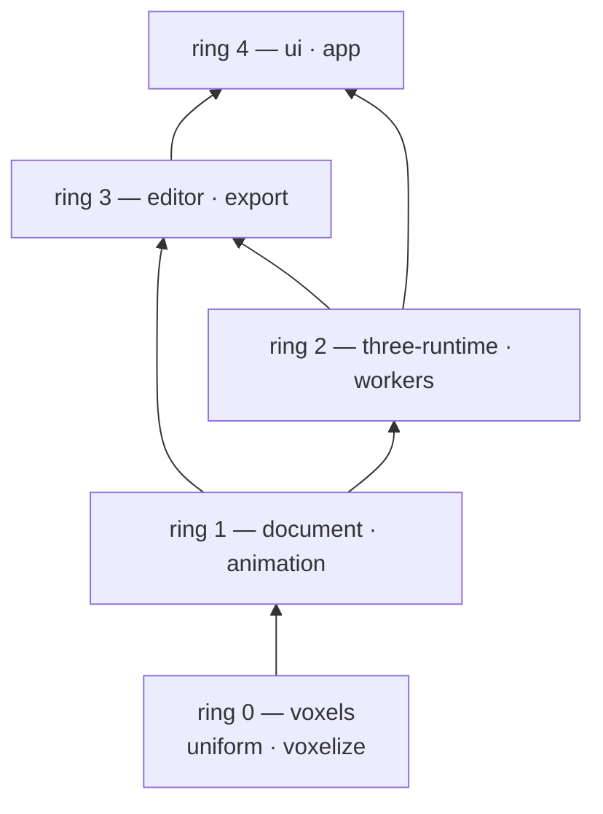

# vox-world — Architecture

## 1. What this repository is

A greenfield TypeScript + Three.js 3D voxel animation editor. The user imports a GLB mesh scene,
voxelizes it, edits spatial layout and shading, animates objects and the camera, and exports
a playable MP4 plus per-frame aligned scene data.

Voxels are a **sparse uniform grid**: object-local integer cell coordinates with a per-object
subdivision of the world unit, held as *editable source data*. Render meshes, GPU buffers, LOD, and
caches are always derived.

There is exactly one voxel representation. A very large static environment is voxelized at one
resolution like everything else and shares the same cell budget: there is no variable local
resolution and no leaf-level editing.

## 2. Design principles

1. **Onion dependency** — our own modules: `import` may only point inward, toward the data. No
   module of ours depends on a module of ours that is further out.
2. **Reuse before writing** — Three.js and its ecosystem are libraries, not framework layers. Every
   part of them may be imported from every ring, including ring 0, and nothing that they already do
   is re-implemented by hand. The onion rule constrains our modules only; it never constrains the
   library. The one thing Three.js may not do is *carry* project data: voxel data and timeline data
   must stay saveable source data while meshes, GPU buffers, and LOD are derived resources. A voxel
   container is not a `Mesh`, an object's transform is not read out of an `Object3D`, and a `Mesh`
   is not a project object's identity. Everything else is fair game, and hand-rolling is the thing
   that has to be justified.
3. **One space, one unit** — right-handed and **+Z up**, with `+X` right and `+Y` forward, metres,
   and a world unit that is the lattice constant: a cell is `1 / subdivision` of it (§6), and the
   ground is the `xy` plane. This is the frame of the project this one exchanges data with, so no
   conversion is needed at that boundary. Cell coordinates, box extents, object transforms, and every
   size the UI reports are in that one unit, at the subdivision they belong to. The output camera and
   the viewport share the convention, which is what lets one authoring model and one export path cover
   everything.
4. **Lightweight** — no speculative abstraction, no configurability that nothing sets, no wrapper
   where a plain module or a library call works.
5. **Precedence** — conflicts here are about *our* boundaries (which module owns a piece of state,
   whether a wrapper earns its keep), not about the library. When one appears, pick the lighter
   option and state the rule in the contract of the file that owns it.

## 3. Toolchain

Pinned exactly (no `^`), with one exception: `@pmndrs/vanilla` carries a caret, because the two shader
patches this repository applies are written against its source, so the tests that drive them are what
pins the package in practice rather than a version number. Three.js ships monthly and its addons
churn; a floating range can silently change what the demo runs on.

| Package | Version | Note |
| --- | --- | --- |
| Node | 24.21.0 (Krypton) | Active LTS, EOL 2028-04-30. Satisfies `vite@8` (`^20.19 \|\| >=22.12`) and `vitest@5` (`^22.12 \|\| ^24 \|\| >=26`). |
| three | 0.186.0 | `three` ships no types; `@types/three` is required. |
| @types/three | 0.186.0 | Exact-match type package. |
| @pmndrs/vanilla | ^1.25.0 | pmndrs' framework-free port of the drei components, MIT; ring 2 imports two of them and nothing else — the grid's `Grid` (`@pmndrs/vanilla/core/Grid`) and the selection outline's `Outlines` (`@pmndrs/vanilla/core/Outlines`). The one caret range. |
| vite | 8.3.0 | Dev server and production build. |
| vitest | 5.0.1 | Unit tests for our own modules; no GPU needed. |
| typescript | 7.0.2 | Fall back to 6.0.3 if the native compiler rejects `@types/three`. |
| mp4-muxer | 5.2.2 | MP4 container for WebCodecs-encoded video. |

Renderer: `WebGLRenderer` only. `three/webgpu` and `three/tsl` are out of scope. Addons are imported
through the `three/addons/*` export map.

## 4. Layering and dependency direction

Five rings. Ring 0 is the innermost; the number grows outward. Dependencies point inward only.


```mermaid
graph BT
  R0["ring 0 — voxels<br/>uniform · voxelize"]
  R1["ring 1 — document · animation"]
  R2["ring 2 — three-runtime · workers"]
  R3["ring 3 — editor · export"]
  R4["ring 4 — ui · app"]
  R0 --> R1
  R1 --> R2
  R1 --> R3
  R2 --> R3
  R3 --> R4
  R2 --> R4
```

| Ring | Module | Responsibility | May import |
| --- | --- | --- | --- |
| 0 | `voxels/uniform` | Sparse uniform voxel grid, cell access and mutation, integer box region query, fill, clear, and extract. | `three` (any) |
| 0 | `voxels/voxelize` | Surface voxelization of `BufferGeometry` into a uniform payload, including color sampling and per-primitive object separation. | `voxels/*`, `three` (any) |
| 1 | `document` | Project truth: scene objects, identity, parent/child hierarchy, transforms, representation binding, timeline data, the authored camera (takes of segments), mask colors. | `voxels/*`, `three` (any) |
| 1 | `document/detach` | Detach: a uniform box region becomes a new scene object. | `voxels/*`, `three` (any) |
| 1 | `animation` | Keyframe authoring data compiled to a Three.js `AnimationClip`; frame-exact sampling through `AnimationMixer`. | `document`, `three` (any) |
| 2 | `three-runtime` | Scene and render state: GLB import into document objects, document-to-scene mirror, derived meshes, raycast picking, viewport controls, offscreen frame capture. | `voxels/*`, `document`, `three`, `@pmndrs/vanilla` (the grid's `Grid`, the outline's `Outlines`) |
| 2 | `workers` | Job boundary for off-main-thread work. Payloads must be plain records and transferables. | `voxels/*`, `document` |
| 3 | `editor` | Editing session: active object, selection, target cell selection, edit operations, output camera versus viewport navigation. | `voxels/*`, `document`, `animation`, `three-runtime` |
| 3 | `export` | Export job: frame loop over the timeline, capture orchestration, encoder and muxer. | `document`, `animation`, `three-runtime`, encoder library |
| 4 | `ui` | DOM panels, toolbars, timeline widget, export dialog, HUD. Renders state and forwards intent; owns no project state. | `document`, `animation`, `editor`, `export` |
| 4 | `app` | Composition root: the only place that knows every module. Session, jobs with cancel, file input and output, and the console report a failure gets. | everything |

**Hard rule.** An `import` may only target its own ring or an inner ring, except for the two
registered same-ring edges:

- `voxels/voxelize -> voxels/uniform`, for the shared value types `HexColor` and `IntBox3` only;
- `animation -> document`.

Any further one is added to this list with a reason. The rule is about our modules. Three.js is a
library and may be imported anywhere, including ring 0, in any part: math, `Color`, geometry,
animation, loaders, `InstancedMesh`. Adding a Three.js import is never a layering violation.

`workers` is a boundary, not a layer: nothing depends on it, it depends on inner rings, and every
value crossing it must be structured-cloneable.

### What is taken from Three.js rather than written here

| Need | Taken from Three.js |
| --- | --- |
| Transform and hierarchy math | `Vector3`, `Quaternion`, `Euler`, `Matrix4` |
| Bounds, ray math, intersection tests | `Box3`, `Sphere`, `Ray`, `Plane`, `Raycaster` |
| Colors including color space | `Color`, `SRGBColorSpace` |
| Scalar helpers | `MathUtils` |
| Voxelizer input, derived meshes | `BufferGeometry`, `BufferAttribute` |
| Keyframe interpolation and playback | `KeyframeTrack`, `AnimationClip`, `AnimationMixer` — `InterpolateDiscrete` for step, `InterpolateLinear` for linear, `InterpolateSmooth` and `InterpolateBezier` for smooth |
| GLB parsing, navigation, gizmos | `GLTFLoader`, `OrbitControls`, `TransformControls` |
| Voxel rendering | `InstancedMesh`, `InstancedBufferAttribute` |

The viewport's grid is the one drawing taken from outside these lists — it still builds on `three`'s
`Mesh`, `PlaneGeometry`, and `ShaderMaterial` — because `three` has no grid material and a shader grid
is not worth hand-rolling, so the drawing comes from `@pmndrs/vanilla`'s `Grid`, the import registered
in the ring table above; the file that uses it patches the library's shaders where this viewport needs
it, one of them because that library lays its floor in a Y-up world's local `xz` plane while this
world's ground is `xy`. The mesh is not turned instead: a turn would leave the floor standing as a
wall.

## 5. Repository map

`src/` holds the five rings of §4, one directory per module. Every implementation file has a contract
under `codemap/`, mirroring its path (§11). A test file is its own specification and has no contract.
The root configuration files are covered by `codemap/toolchain.md`.

## 6. Core data model

### Truth versus derived

| Truth (source data) | Derived (rebuilt on demand, never exported and never saved) |
| --- | --- |
| `Project.objects` and their hierarchy | Three.js `Object3D` hierarchy |
| Object transforms and names | Matrix world caches |
| Uniform cells (keys and colors) | `InstancedMesh` instances and per-instance colors |
| Timeline tracks and keyframes | `AnimationClip`, `AnimationMixer`, and the per-frame `Object3D` transforms they drive |
| The authored camera (`Camera`: takes, segments, keys) | The output camera's resolved shot, viewport camera and controls state |
| Object mask colors | Mask-pass material instances |

Voxel and timeline data are plain records and typed arrays, not Three.js render objects: no project
object's truth is a `Mesh`, and no project object's identity is an `Object3D`. Three.js *value*
types (`Color`, `Vector3`, `Quaternion`, `Box3`) are used freely inside that data. Derived resources
are keyed by project object id and invalidated by a per-object `dirty` flag.

### Scene objects

```
SceneObject {
  id: string            // stable, never reused, never derived from a mesh or node name
  name: string
  parentId: string | null
  transform: { position, quaternion, scale }
  representation: 'empty' | 'uniform'
  uniform?: UniformGrid  // present iff representation === 'uniform'
  maskColor: number      // object-level color, hex number as exchanged with THREE.Color
  alignToGrid: boolean
}
```

- Hierarchy is legal at all times: one parent per object, no cycles, deletion detaches children.
- `representation` binds the object to exactly one voxel container, and `Project.setPayload` is the
  only transition: importing creates `'empty'` placeholder nodes, voxelizing attaches a payload to
  the matching placeholder (turning it into a `'uniform'` object without changing its id, name,
  parent, or mask color), and clearing the payload returns it to `'empty'`.
- Placement sits on the world grid by default: every object is created with `alignToGrid` set, and
  while it is set the object's own transform holds a whole number of *its own* cells — one world unit
  at subdivision 1 — so its voxels fall on the lattice rather than half a cell off it. A transform
  write snaps to the nearest cell, and the gizmo's live preview is snapped the same way so a release
  never jumps. A keyframe authored for the object's position stores whole cells while the mixer keeps
  interpolating smoothly between them. The flag is the panel's `Grid align` checkbox, and switching it
  on pulls the object onto the grid there and then.
- An object with `representation: 'empty'` is a transform-only node (group). Object hierarchy is the
  only structure there is: a scene node is never used to express voxel resolution, and no voxel
  container ever holds object structure.

### Cells and units

- A voxel grid stores a `subdivision` `k` — a power of two, `1` by default — and one cell is `1 / k`
  of a world unit, so a model can be as fine as its own content needs while the world unit stays the
  constant everything else is measured in. Raising `k` subdivides the model; every cell-to-world
  mapping (rendering, picking, the box preview, snapping, detach) follows it, and the object keeps
  its world placement. A grid therefore stores its subdivision and never a cell length.
- Cell indexing is min-corner, in object-local space, on the world's own axes — `x` right, `y`
  forward, `z` up (§2): a cell `(x, y, z)` of size `v` occupies `[x·v, (x+1)·v]` on each axis,
  coordinates may be negative, and the packed integer key space covers `[-512, 511]`. Min-corner
  indexing is what makes detach's re-indexing exact for odd-sized regions.
- Occupied cells map to a color stored as a hex number, the form `Color.getHex()` and
  `Color.setHex()` exchange, so conversion, color-space handling, and mixing go through
  `THREE.Color`. Cell keys are integers packed from the three coordinates, which keeps `Map` lookups
  allocation-free. Writing a cell that is already occupied replaces its color.
- Two different objects may overlap in space: they are scene leaf nodes and the renderer draws both.
  *Within* one container voxels are never duplicated, so there is no arbitration rule, no priority
  field, and no resolution pass.
- `detach` moves a uniform box region out of its container into a new object of the same
  representation, re-indexes the extracted content so its min corner becomes local `(0, 0, 0)`, and
  gives the new object a translation-only transform equal to the extracted region's world min corner
  — composed against the parent's world matrix — so the world-space position, volume, and appearance
  are unchanged. The source container must not keep a duplicate occupancy at that location.
- **Uniform region selection is an axis-aligned integer box.** The anchor is taken where the pointer
  goes down, the opposite corner follows the pointer, and both resolve to integer cell coordinates in
  the object's local grid, inclusive on both corners and one cell deep on the axis the drag runs along,
  so what the pointer draws is what commits. `add`'s box is that region stepped one cell out of the
  pressed face — its anchor is the empty cell the face opens onto — and a tracked drag with the Edit
  group's `Add wall` field above one builds it that many cells deep along the same face normal, while
  `select`, `paint`, and `remove` take the cells the pointer named, so a press on a face edits what the
  user sees. A single click is the degenerate 1×1×1 box, so point editing needs no separate tool.
  Detaching the region is a command on it rather than a fourth mode, and no tool can be left armed to
  detach the next thing a press lands on.

### Cameras and render state

- Exactly two cameras exist at runtime. `SceneMirror.camera` is the **output** camera: posed by
  `animation/playback.ts` from the take the project holds at the playhead, and the camera the
  document holds — the active take resolved at the playhead — and the one every render, every export and the carrier
  goes through. The **viewport** camera is
  app-owned runtime state, never project data: it is what navigation moves, what picking resolves
  against, and what `frameAll` fits. The viewport renders through the output camera only while a run
  previews the shot; nothing retargets navigation, and no navigation writes the authored camera. Both
  stand in the world's frame — `up = (0, 0, 1)`, written before the viewport's controls are built,
  because `OrbitControls` takes its orbit axis from the camera's `up` in its constructor and cannot be
  changed afterwards — so the `lookAt` inside `frameAll` rolls a fitted view to the world's `+Z` rather
  than to three's default `y`.
- Render layers separate what is edited, what is only shown, and what is exported:
  - **Layer 0** is scene content — the voxel instances and the output camera — and it is the only
    layer an export renders.
  - **Layer 1** is viewport decoration: the box preview, the world grid on the `xy` ground, the camera
    carrier and its path. It is never picked and never exported.
  - **Layer 2** is the imported source mesh, kept for the raw-mesh versus voxel comparison: the
    viewport camera enables 0, 1, and 2, the raycaster tests 0 and 2, the export camera and `Capture`
    use 0 alone, and `frameAll` measures 0 and 2 so an import frames the real model before any voxel
    exists.
  - **Layer 3** is the selection outline's own layer, drawn in a pass of its own over the finished
    frame so the selected object alone cuts its rim, and never picked or exported.
  Feedback uses layers rather than an `if` at each call site.
- One background, defined in the project (`ProjectSettings.background`, default `0x3d4250`) and
  mirrored by the page as `--scene` for the page and the canvas, so nothing darker shows behind or
  beside the viewport.

## 7. Cross-layer ports

Everything else is a direct call. These are the only abstractions that exist because a real boundary
requires one. The voxelizer, for instance, takes `BufferGeometry` plus a world matrix per imported
node directly, rather than a wrapper type invented for it.

| Port | Shape | Boundary it crosses |
| --- | --- | --- |
| `VoxelizeJob` | `{ request, progress, result, error }` plain records | Main thread into a worker. **Reserved, not yet declared:** no file owns this type until `src/workers/` exists, which is why it is a record shape rather than an interface with methods. |
| `FrameSink` | `push(frame, index, kind)` | Renderer into the encoder. The only reason the encoder is replaceable, and the seam the mask and depth passes share. |

## 8. Render and runtime conventions

- **One frame, one conversion at the door.** The world is right-handed and Z-up (§2), so the ground
  is the `xy` plane; glTF is Y-up by definition, so the parsed import root gets exactly one quarter
  turn about `x` before any world matrix is read, and nothing else in the runtime converts an axis.
- **Both renderers use a logarithmic depth buffer** — the viewport and the export capture — because a
  scene measured in metres can span kilometres. A `ShaderMaterial` that writes depth without three's
  `logdepthbuf` chunks sorts wrongly against the voxels, which is why the grid patches its library's
  vertex and fragment source.
- **Decoration never reaches an edit or an export.** Layer-1 drawings and the layer-3 outline are
  never picked, never drawn into an exported frame, and outside `frameAll`'s measurement.
- **The mask pass is a second pass** over the same scene with the mask materials; the export walks
  the timeline frame by frame and captures at the export resolution, one frame per capture read.
- **The editor has two modes.** `Object` shows the gizmo, and the selection outline marks the object
  the gizmo is on; `Edit` shows the voxel tools, and the tool row only matters there — `Edit` needs an
  active object.
- **A run of the clip is the app's transport, and it is reversible.** Play renders the viewport
  through the output camera for the length of the run; a pause hands the editor camera the pose the
  clip stopped at; a non-looping run's end restores the playhead and the view it started from. None
  of it writes the document.
- **A failure reaches the console.** The app has no status line, no progress row, and no error line;
  every error literal and detail is still produced and still reaches its caller, and the `Result`
  unions are untouched.

## 9. Demo slice

The first runnable version must demonstrate the acceptance scenario end to end. Everything listed as
deferred is deferred deliberately, not forgotten.

### In scope

- Import a GLB, auto-frame the view, and show the raw mesh for comparison against the voxel result.
- Voxelization is asked for when a model arrives: parse, scale it onto the world lattice, adopt as one
  object, fit the view, then a modal dialog with the one setting — how long the model is in voxels;
  confirm runs it with cancel and a budget guard, and cancel leaves the raw model visible.
- Toggle the raw mesh against the voxel result; assign one mask color per object.
- Select and edit voxel objects: create, name, delete, hide, transform, reparent. In `Object` mode the
  object the gizmo is on is wrapped in a yellow outline (`@pmndrs/vanilla`'s `Outlines` over that
  object's own instances), which comes and goes with the gizmo and is drawn in a pass of its own over
  the finished frame, so the object alone cuts the rim: it is never picked, never exported, and never
  widens a framing.
- Voxels: drag a box (anchor, opposite corner) to select it, or to add, remove, paint, or detach it as
  a new object; a click is a 1×1×1 box. `add` writes the box in front of the face it pressed — one
  cell on a click, and a wall `Add wall` cells deep on a drag — while `select`, `paint`, and `remove`
  take the cells the pointer names.
- Viewport grid: one plane of shader-drawn lines on the world's `xy` ground at `z = 0`, one white line
  per world unit and a brighter one every twenty cells, switched by the Grid group's `World grid` box.
  It is decoration: layer 1, never picked, never exported, and outside framing's measurement. Every
  voxel face also carries a one-pixel border at 22% of its own colour, which is what makes a mass of
  cubes read as countable cells.
- Subdivision: raise one object's own grid to a finer level from the Scene group, and have every
  cell-to-world mapping — rendering, picking, the box preview, snapping, `detach` — follow it.
- Timeline: a duration at authored precision and a frame rate, keyframes on object transforms addressed by session id,
  step/linear/smooth interpolation, one Play/Pause toggle,
  loop, and scrub. The bar starts collapsed and is summoned from the rail's `Animation` button. The camera is not on
  that bar: it is authored as takes of segments — each with its own keys, projection, and lens — from the `Camera`
  group, where the shot is aimed from third person through its carrier, copied as a whole plan, cut at the playhead,
  and given its projection and clip planes, while its trajectory is drawn back into the viewport as a white
  polyline with one hollow ring per key, shown from two keys up. A run previews the shot
  through the output camera and a pause hands the frame back.
- Export the output camera view to a real MP4 with selectable resolution, frame rate, and range, with
  cancel; a failure reaches the console.
- Save the whole project to one JSON file and open it back, in place: every object with its cells,
  hierarchy, mask color, and placement, plus the camera, the settings, and the timeline.

### Acceptance flows

- **Scenario A** — import a GLB whose parts are separate nodes and which arrives as one object with
  one payload; separate one part from it by dragging a box over it and choosing Detach, give that part
  and the camera keyframes, export an MP4 with the mask colors.

The models the flow was first run on were generated by `tools/make-demo-glb.mjs`; that generator and
its `island.glb`/`big.glb` outputs have since been removed, so the flow now runs on a GLB supplied for
the walk. What it asserts is unchanged: the node structure above is the only requirement an asset has
to meet.

### Deferred

| Deferred | Why it is safe to defer |
| --- | --- |
| Undo and redo, command transactions | Edit operations are pure functions over document state with an explicit apply step, so a command layer can wrap them without rewriting them. |
| Voxelization worker | Voxelization touches no scene state and is driven by a chunked loop with progress and cancel, so it can move into a worker unchanged. |
| Depth and object-id frame export | The mask pass already proves the second pass path; the MP4 is the required deliverable. |
| Base color texture sampling | Assets use material base color and vertex colors; sampling will go through `THREE.Color` and the geometry attributes. |
| Skinning, morph targets, animations inside GLB | The requirements do not ask for them. |
| View-dependent LOD, GPU memory offload | Not needed at demo scale. |

## 10. Validation

```bash
npm run typecheck   # tsc --noEmit
npm test            # vitest run
npm run check       # typecheck + test
npm run dev         # vite dev server
npm run build       # production build
git diff --check
```

Unit tests cover our own modules — voxels, document, animation: uniform box region math and extraction,
detach identity and world-space preservation, project hierarchy legality and payload transitions, clip
compilation and frame-exact sampling, and voxelization surface correctness. Rendering, picking, and
export are verified by running the application and by inspecting the produced MP4.

## 11. Contracts

Per-file contracts live in this directory, mirroring `src/` one-to-one without an extra `src` segment;
the root configuration files are covered by `codemap/toolchain.md`.

Each contract states the file's responsibility, its public interface as TypeScript signatures, its
internal logic, its invariants, its error results, its dependencies, and the tests that pin it. No
implementation file is added without its contract in the same change, per `AGENTS.md` section 3.
Contracts are read critically: a contract rule that is unsound or contradicts this document is
reported, not silently followed.

### Conventions every contract follows

- ESM, no barrel `index.ts`; imports carry the `.js` extension.
- No `any`; `unknown` only at parse and IO boundaries, narrowed immediately.
- User-facing operations (import, voxelize, export, detach, file IO) return a discriminated result
  `{ ok: true; ... } | { ok: false; error: '<literal-union>'; detail: string }`. Programmer errors
  (bad argument type, out-of-range index, violated invariant) throw `TypeError` or `RangeError`.
- Long operations run as chunked loops that yield to the host every `CHUNK = 512` items and accept an
  `AbortSignal`, so progress and cancel work on the main thread without a worker.
- Units are cells: a cell is `1 / subdivision` of the world unit and a model at subdivision 1 is one
  cell per world unit, so cell coordinates, box extents, object transforms, and every size the UI
  reports are in that one unit at the subdivision they belong to.
- Tests live in `tests/<name>.test.ts` and run under vitest in the node environment: no GPU, no DOM,
  no `WebGLRenderer`. Importing `three` for math and geometry is allowed.

## 12. Open questions

Each must be resolved before the feature that depends on it ships, and the resolution recorded here.
The first runnable slice answers them provisionally so it can be built; a provisional answer is a
working default, not a settled design.

| Question | Provisional answer for this slice | Still open |
| --- | --- | --- |
| GLB feature range | Uncompressed glTF 2.0 geometry, `pbrMetallicRoughness.baseColorFactor`, and vertex colors. Draco, Meshopt, and KTX2 are reported as `unsupported` rather than half-loaded. | Which extensions real content actually needs. |
| Color sampling for textures | Base color factor and vertex colors only; texture sampling is deferred and the sampling seam is `ColorSource`. | UV sampling rules, wrapping, and color space handling for textured content. |
| Real-world scale and budget | Scale is answered: content is scaled onto the world lattice, so a model's size is its cell count, and `budget = 4_000_000` cells is what a job may claim; a run above it leaves the existing scene untouched. | The budget for real content, and whether it must be split into a per-object quota plus a total. |
